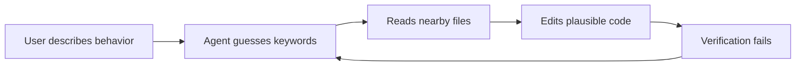
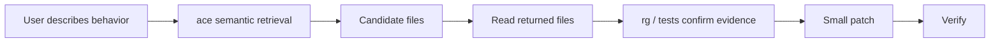

> I am not a native English speaker; this article was translated by AI.

In the [previous post](/en/posts/ai-coding-harness-engineering-workflow/) about Harness Engineering, I compressed my default AI coding workflow into a few steps:

1. Read
2. Search
3. Change
4. Verify
5. Record

Among these steps, `Search` is the easiest one to underestimate.

Many agents fail because they read the wrong place first. The user describes a behavior, a bug, or a cross-layer workflow, while the code may not contain a function with the same name. Running `rg login`, `rg upload`, or `rg session` is fast, but it only works when the keyword is already known. If the keyword is unknown, speed just helps the agent drift faster.

So I open-sourced a small layer I have been using recently:

[ferstar/ace-wrapper](https://github.com/ferstar/ace-wrapper)

It does one narrow thing: wrap Augment Context Engine's filesystem context search as an `ace` command, so coding agents can do semantic retrieval from the shell before editing.

### Why This Layer Exists

The target is concrete: make the search action part of the harness.

I used to see this path often:



The problem with this loop is that, after failure, the agent often keeps circling around the same wrong files. It can edit code; it needs a better entry point into candidate files.

`ace-wrapper` is meant to patch this part:



The important part is the order: `ace` only finds candidate files. Conclusions still require reading files, exact search, and tests.

### Usage Is Short

Install it:

```bash
uv tool install ace-wrapper
```

Install a local development checkout:

```bash
uv tool install /path/to/ace-wrapper
```

Search for a workflow when the exact keyword is unknown:

```bash
timeout 60s ace "user uploads an unsupported file and should see skipped-file feedback" -w /repo
rg -n "unsupported|skipped|upload|file" /repo
```

The first command answers “which files may be relevant.” The second command confirms “which identifiers, events, copy, or tests actually exist in the code.”

I usually put this rule into a project's `AGENTS.md`:

```text
Use `timeout 60s ace "<query>" -w <repo-root>` for semantic codebase discovery.
Treat `ace` results as candidate files.
After it returns results, read the relevant files and use exact search before using them as evidence.
```

These lines work better than “read more context,” because they give the agent a concrete action and a boundary against false conclusions.

### How It Works with rg

`ace` and `rg` work better as consecutive steps.

| Scenario | Use First | Why |
|:---|:---|:---|
| You know the behavior but not the implementation location | `ace` | Behavior descriptions can find candidate entry points across files and naming styles |
| You know the function name, event name, or error text | `rg` | It is exact, complete, and enumerable |
| You need a structural refactor | `ast-grep` | AST-level matching is needed; textual proximity falls short |
| You need to confirm whether a feature exists | `ace` + read files + `rg` | A semantic hit cannot prove the feature exists |

I intentionally wrote this boundary into the README: ACE returns candidate files, while evidence still has to come from code and tests. That boundary matters.

Semantic retrieval returns “nearby” things. If you ask about a feature that does not exist, it may still find files that look related. If an agent treats “there are results” as “the feature exists,” it starts inventing a story. A conclusion is only defensible after reading an implementation, test, route, config, or call site.

### Where It Fits in Harness Engineering

`ace-wrapper` is small, and I want it to stay that way. It is closer to a small gear in the harness: it turns open-ended code discovery into a repeatable, constrained command.

I now prefer this project rule:

```text
Read -> Search -> Change -> Verify
```

Here, `Search` means choosing the tool by problem type:

- Open-ended behavior and cross-layer workflows: use `ace` first
- Exact identifiers, errors, routes, and config keys: use `rg`
- Structural replacements: use `ast-grep`
- External strategy and industry practice: use web research
- Old decisions and repeated lessons: use memory

The useful part of this split is reduced agent randomness. The agent first uses semantic retrieval to narrow the reading surface, then uses deterministic tools to confirm facts, and only then changes code.

### The Prompt Matters Most

A good `ace` query describes behavior and avoids keyword piles:

```bash
timeout 60s ace "frontend sends requestId to backend and starts a processing job" -w /repo
timeout 60s ace "用户拖入不支持的文件后应该显示跳过文件提示" -w /repo
timeout 60s ace "how provider config is persisted and restored after app restart" -w /repo
```

I try to include four kinds of information:

- User action: click, drag, upload, stop generation
- Runtime boundary: frontend to backend, CLI handler to core service
- Expected effect: persist config, abort loop, show skipped-file feedback
- Known fields: `sessionId`, `requestId`, `files`, `workspace`

This is much more stable than only searching `upload` or `provider`. It lets the retrieval system look for behavior and data flow, and it reminds the agent that this step is still semantic retrieval.

### Why I Open-Sourced It

`ace-wrapper` has very little code. The core is just `FileSystemContext.create(str(workspace))` plus `context.search(args.query)`. I wanted to preserve the workflow constraints around those few lines:

1. If the keyword is unknown, start with semantic retrieval.
2. Ask one workflow per query.
3. Treat results as candidate files.
4. Read the files, then use `rg` to confirm exact evidence.
5. Do not conclude without evidence.

Once these rules live in the tool README, skill, and agent prompt, they become much more likely to stick. Otherwise every session depends on a human reminding the agent again.

The previous post said Harness Engineering means putting an engineering track around AI. `ace-wrapper` is one small piece of that track: its job is modest, helping the agent read the right place first.
