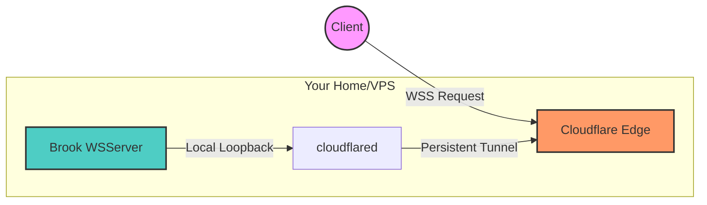

> **Note:** Technical audit performed in 2026. While protocols evolve, the underlying logic of Cloudflare's edge acceleration remains robust.

### The Principle
Use `Cloudflare Tunnel` to map local services to Cloudflare's edge network. VPS with poor connectivity (like Oracle Free Tier) can gain a significant speed boost through CDN edge acceleration.

### Setup Guide

1.  **Preparation**:
    *   [Cloudflare Zero Trust Dashboard](https://one.dash.cloudflare.com/): Create a Tunnel directly in the dashboard—it's much easier than managing certificates via CLI.
    *   [Brook wsserver](https://txthinking.github.io/brook/#/brook-wsserver): A very simple and logical proxy tool.

2.  **Start the Server**:
    `brook wsserver --listen 127.0.0.1:8888 --password your_pass`

3.  **Configure the Tunnel**:
    In the Cloudflare dashboard, point your domain (Public Hostname) to `http://localhost:8888`.

4.  **Crucial Setting (Must Do)**:
    **Ensure WebSocket support is enabled** in Cloudflare's "Network" settings; otherwise, the WSS connection will be terminated immediately.

5.  **Client Connection**:
    Select **WSS** mode on your client. Traffic now flows through the encrypted tunnel.

### Pros and Cons

**Pros:**
*   **Stealth**: Your VPS IP is never exposed. Cloudflare handles all traffic, significantly reducing the risk of IP blocking.
*   **Penetration**: Works in IPv6-only or NAT/internal network environments.
*   **Free**: Cloudflare's free tier for personal users is more than sufficient.

**Cons:**
*   **Latency**: The extra hops add latency (typically in the hundreds of milliseconds), making it unsuitable for gaming.
*   **UDP**: Support for non-HTTP UDP traffic is limited; recommended for TCP/WSS scenarios.

### Further Reading
*   [Hysteria 2](https://github.com/HyNetwork/hysteria): A performance monster for non-CDN scenarios.
*   [Cloudflare WARP](https://1.1.1.1/): For auxiliary optimization.

---
*Created: 2022-03-16*
*Updated: 2026-01-04*
