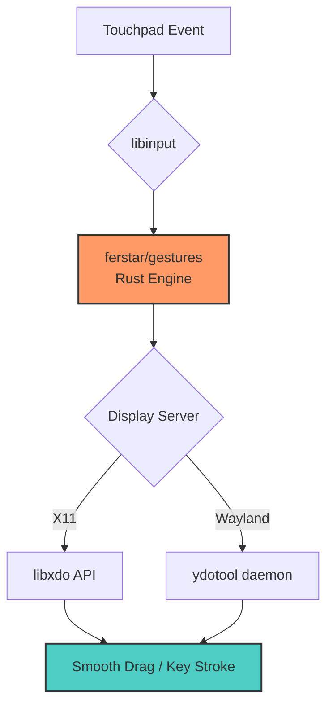

After switching to Linux, I've been missing the smooth **three-finger drag** experience from macOS. Given that recent Windows laptops have significantly improved touchpad size and responsiveness, I decided it was time to tackle **touchpad gestures** on Linux.

---

## Research and Selection

There are basically two approaches to implementation:

1. Parsing `libinput debug-events` output and using tools like `xdotool` to send keystrokes or mouse clicks.
2. Calling the `libinput` API directly, which offers the best performance.

---

## Implementation

I chose to fork and merge two Rust projects to create a unified solution. One project handles general [gestures](https://github.com/riley-martin/gestures), and the other focuses on the [three-finger drag](https://github.com/marsqing/libinput-three-finger-drag) effect at the API level.

### Architecture



The project is now at **v0.8.1**, with major improvements including:

- **Dual Platform Support**: Works on both X11 and Wayland (auto-detection).
- **Performance Optimization**:
  - Direct `libxdo` API calls for X11 (minimum latency).
  - Optimized `ydotool` integration for Wayland with 60 FPS throttling.
  - Thread pooling to prevent PID exhaustion.
  - Regex and config caching for speed.

---

## Performance Metrics

1. **Low CPU Usage**
   - Even under intense three-finger dragging, this implementation uses less than 1% CPU.
   - Competing Python or Ruby implementations often exceed 20%.

2. **Resource Efficiency**
   - Memory usage: < 5MB.
   - Binary size: < 2MB.
   - Zero unnecessary dependencies.

---

## Installation & Usage

### Dependencies

**Ubuntu/Debian:**
```bash
sudo apt install libudev-dev libinput-dev libxdo-dev xdotool
# For Wayland
sudo apt install ydotool
```

**Arch Linux:**
```bash
sudo pacman -S libinput xdotool
# Wayland
yay -S ydotool
```

### Install Binary

**Option 1: Pre-compiled Binary (Recommended)**
```bash
wget https://github.com/ferstar/gestures/releases/latest/download/gestures
chmod +x gestures
sudo mv gestures /usr/local/bin/
```

**Option 2: Install via Cargo**
```bash
cargo install --git https://github.com/ferstar/gestures.git
```

---

## Configuration

The config uses the KDL format. Example:

```kdl
// Three-finger drag (X11 & Wayland)
gesture "drag" swipe any {
    fingers 3
    acceleration 1.0      // Drag speed
    mouse_up_delay 500    // Delay after lifting fingers (ms)
}

// Four-finger swipe up to switch workspace
gesture "switch-workspace-up" swipe up {
    fingers 4
    exec "xdotool" "key" "super+Page_Up"
}
```

---

## Running the Program

### Systemd Service

```bash
# Install service file
gestures install-service

# Enable and start
systemctl --user enable --now gestures
```

---

## Common Issues

### Permission Denied
You need to add your user to the `input` group:
```bash
sudo usermod -aG input $USER
```

---

## Links

- **GitHub**: https://github.com/ferstar/gestures
- **Issues**: https://github.com/ferstar/gestures/issues

---
**Enjoy!**
