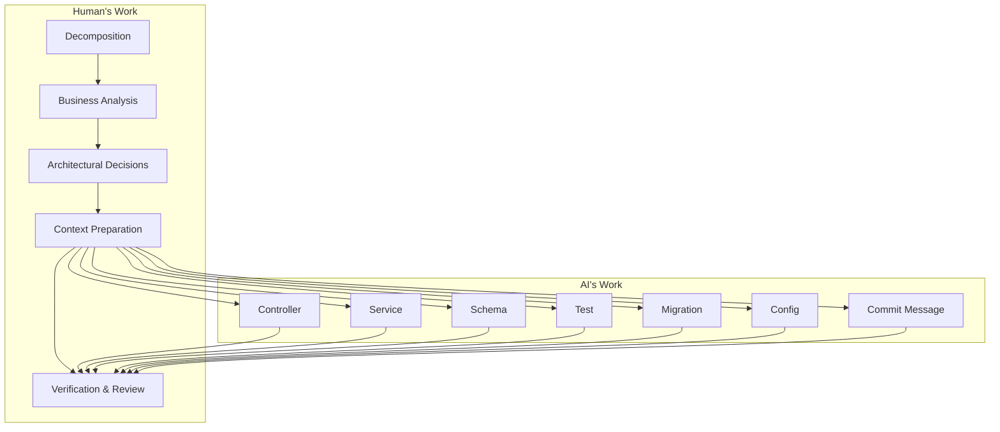
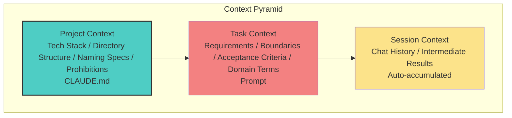
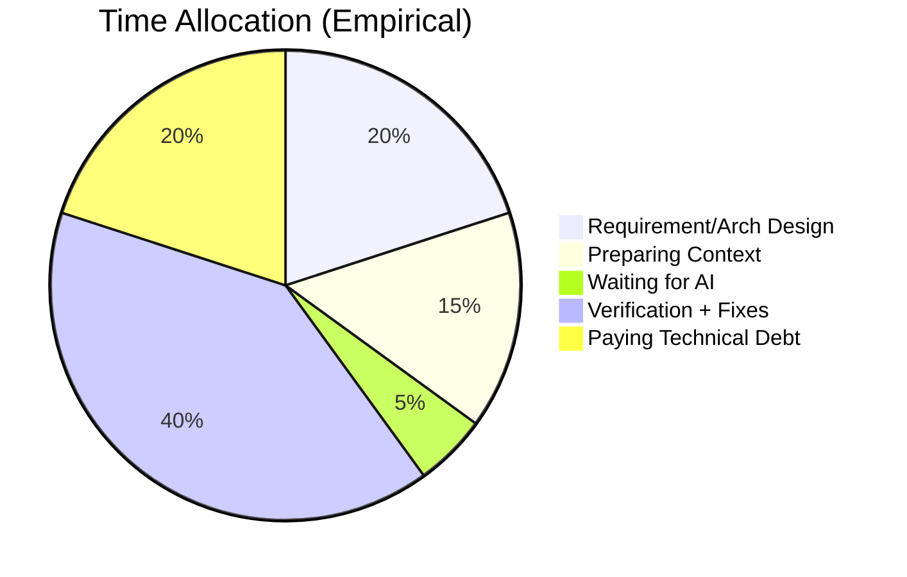
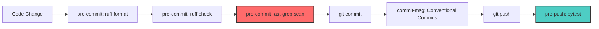
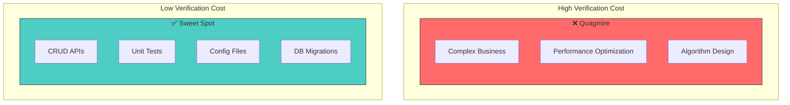

> I am not a native English speaker; this article was translated by AI.

> Based on the Vibe Coding Skeleton engineering practice.
> **Note**: For specific implementation details, refer to `CLAUDE.md`, `.pre-commit-config.yaml`, `ast-grep/`, `sgconfig.yml`, and `justfile` in this repository.

---

**TL;DR**: It is not about "letting AI write code," but "using engineering to ensure AI writes the *right* code."

---

### I. A Hard Fact

#### 1.1 The Data Shock

> Consider a real project (anonymized), iterated over ~8 months with 1k+ commits.
>
> Aside from requirement decomposition, business analysis, architectural adjustments, and final acceptance—
> **the vast majority of the code was generated by AI, while humans focused on decision-making and verification.**
>
> Today, we aren't debating *if* AI can write code.
> We are discussing: **How to make AI write the code correctly.**

**Project Overview**:

| Metric | Value (Anonymized) |
|:---|:---:|
| Dev Cycle | ~8 Months |
| Total Commits | 1k+ |
| Active Days | 200+ |
| Avg Commits/Day | ~5 |
| Conventional Commits Compliance | >95% |

**Commit Type Distribution**:

| Type | Share | Description |
|:---|:---:|:---|
| feat | ≈40% | New Features |
| fix | ≈20% | Bug Fixes |
| refactor | ≈20% | Refactoring (including AI code optimization) |
| test | ≈5% | Unit/Integration Tests |
| others | remainder | chore/docs/perf, etc. |

**Development Phase Evolution**:

| Phase | Characteristics | Focus |
|:---|:---|:---|
| Sprint Phase | Higher `feat` ratio | Rapid MVP verification + Quality gates |
| Stability Phase | Rising `fix/refactor` | Automated regression + Edge case/Perf validation |

#### 1.2 The Role Shift

**Traditional Perception** vs. **Reality**:

| Traditional Perception | Reality |
|:---|:---|
| AI helps you write *some* code | AI generates *most* code; humans decide and verify |
| Human + AI collaboration | Human commands, AI executes, Human accepts |
| Learning to *use* AI | Learning to *verify* AI and *feed* context |

**The New Workflow**:



**Role Definitions**:

| Role | Responsibility | Unreplaceability |
|:---|:---|:---:|
| Product Manager | Requirements, Priorities | ⭐⭐⭐⭐⭐ |
| Architect | Tech Stack, Module Partitioning | ⭐⭐⭐⭐⭐ |
| QA | Validation, Edge Cases | ⭐⭐⭐⭐ |
| ~~Coder~~ | ~~Writing Code~~ | ~~Replaced by AI~~ |

---

### II. Why It Works

#### 2.1 Context is King

**The Core Formula**:

```
AI Coding Level = Your Context Provision Level
```

**The Complete Version**:

```
AI Delivery Quality = Context Quality × Automated Verification × Task Alignment
```

Without verification, output is just a draft. Without task alignment, verification costs explode.

**The Three-Layer Context Model**:



**Investment Return**:

```
ROI: Project >> Task >> Session

Project: 8h investment → Benefits all tasks (Compound Interest)
Task: 5-10min → Current task only
Session: 0 → Current conversation only
```

**Conclusion**: Project Context is an "invest once, benefit continuously" asset. Spending time on a perfect `CLAUDE.md` is the highest ROI move.

#### 2.2 The Bottleneck Shift

**My Time Allocation**:



**Key Insight**: 40% of time is spent "verifying," not "writing." The bottleneck has shifted from generation to validation.

---

### III. How It's Done

#### 3.1 Project-level Context: CLAUDE.md

This project uses a ~300-line `CLAUDE.md` as an "AI Onboarding Manual."

> **Note**: Different AI tools prefer different filenames (e.g., `CLAUDE.md`, `.cursorrules`, `AGENTS.md`). The essence is the same: translate your project rules into machine-readable specs.

**Core Structure**:

```markdown
# CLAUDE.md

## Project Overview        # What the project is for
## Technology Stack        # Litestar + PostgreSQL + Redis + OpenDAL + Celery
## Basic Rules             # Activate venv first, manage deps with uv
## Development Commands    # just lint, just test
## Architecture Overview   # DDD layers, business grouping under src/domain/
## Coding Style            # ruff formatting, 150 char line width
## Testing Guidelines      # pytest (fail-fast, warnings-as-errors)
## CLI Commands            # litestar database upgrade, litestar run
```

##### Case Study: How ast-grep Intercepts Bad AI Habits

**Requirement**: Write a function to process a temporary PDF file.

**Typical AI Output**:

```python
import tempfile
from pathlib import Path

def process_pdf(content: bytes) -> str:
    # Using delete=False for subsequent processing
    with tempfile.NamedTemporaryFile(suffix=".pdf", delete=False) as tmp:
        tmp_path = Path(tmp.name)
        tmp.write(content)

    try:
        result = parse_pdf(tmp_path)
        return result
    finally:
        tmp_path.unlink(missing_ok=True)  # Manual cleanup
```

**The Issues**:
- `delete=False` forces manual cleanup logic, increasing maintenance cost.
- Cleanup logic is easily missed or written incorrectly (e.g., forgetting `try/finally`), leading to file leaks.

**ast-grep Interception**:

```bash
$ git commit -m "feat: add pdf processor"
error[no-tempfile-delete-false]: NamedTemporaryFile with delete=False is forbidden
  --> src/utils/pdf.py:6:10
   |
 6 |     with tempfile.NamedTemporaryFile(suffix=".pdf", delete=False) as tmp:
   |          ^^^^^^^^^^^^^^^^^^^^^^^^^^^^^^^^^^^^^^^^^^^^^^^^^^^^^^^^
```

**Fixed Version**:

```python
def process_pdf(content: bytes) -> str:
    with tempfile.NamedTemporaryFile(suffix=".pdf") as tmp:  # default delete=True
        tmp_path = Path(tmp.name)
        tmp.write(content)
        tmp.flush()  # Ensure data is on disk

        result = parse_pdf(tmp_path)
        return result
    # Automatic cleanup on block exit, zero leak risk.
```

**The Point**: Don't rely on AI "voluntarily obeying" your rules. Use `ast-grep` to **force compliance**.

#### 3.2 Automated Validation Workflow

AI-generated code must pass through a quality pipeline. If the gate fails, the code doesn't enter the main branch.

**The Pipeline**:



**ast-grep Rules (Selected)**:

| Rule ID | What it Intercepts | Why |
|:---|:---|:---|
| no-match-case | `match/case` syntax | Cython compatibility |
| no-tempfile-delete-false | `NamedTemporaryFile(delete=False)` | Prevent leaks, reduce boilerplate |
| no-global-src-import-in-cli | `**/cli.py` importing `src.*` | Avoid startup side-effects / circular deps |
| no-local-import-in-prod | "Local imports" in production code | Keep dependencies visible for auditing |

---

### IV. Boundaries and Stop-Loss

#### 4.1 Sweet Spot vs. Quagmire

It's not about whether AI *can* write it—AI can write anything. It's about whether the **verification cost** is acceptable.



##### Case Study: The Correct Way to Optimize Performance

**Scenario: N+1 Query Optimization**

**Problem**: A list API response time spikes from 100ms to several seconds.

**Wrong Way** — Letting AI "guess" without data:
> Me: "This API is slow, optimize it."
> AI: "Add caching / Add indexes / Preload..." (Often ineffective shots in the dark).

**Correct Way** — Feed the AI "Runtime Facts":
1. **Human**: Execute `EXPLAIN (ANALYZE, BUFFERS)` in test env.
2. **AI (Analytical)**: Locate bottleneck based on the plan (e.g., duplicated scans in a subquery).
3. **Human**: Confirm the rewrite strategy + required migration.
4. **AI (Executive)**: Generate code + migration scripts + tests.
5. **Human**: Run `just test` and compare load test metrics.

#### 4.2 The Abandonment Threshold

| Signal | Action |
|:---|:---|
| Fails 3 times in a row | Write it yourself |
| Explaining > 5 mins of domain knowledge | Write it yourself |
| Safety-sensitive logic | Write it yourself + Peer Review |

---

### V. The Elephant in the Room

#### 5.1 Is your concern valid?
"If AI writes the code, what am I?"

- **Is it just "KPI Marketing"?** No. Prompt engineering, requirement decomposition, and verification *are* programming, just in a different language.
- **How do Juniors learn?** By reading high-quality open-source code and reviewing AI mistakes, rather than mindlessly typing CRUD.
- **Reviewing AI is tiring.** Yes. It takes 40% of the time because AI code "looks" correct but may hide subtle bugs.

#### 5.2 A Reality Check
You aren't the AI's secretary; **the AI is your intern**.
- The intern can work, but you must tell them what to do.
- The intern makes mistakes; you must review them.
- If the intern does well, the credit is yours.

The difference? This intern doesn't sleep, doesn't complain, and you can manage ten of them at once.

**Has the barrier to entry lowered?**
No. It has **shifted**—from "knowing how to type code" to "knowing how to understand systems + verify them."

**In the AI era, the requirements for engineers are actually HIGHER, not lower.**

---

### VI. Action List (TL;DR)

- [ ] Create `CLAUDE.md` with your tech stack and rules.
- [ ] Solidify a zero-cost validation loop (e.g., `just lint`, `just test`).
- [ ] Configure `pre-commit` hooks (ruff + ast-grep).
- [ ] Identify "Sweet Spot" tasks for AI delegation.

**Tools change, but our value in solving problems remains. Be the driver of AI, not the passenger.**

---
*Created: 2025-12-31*
*Updated: 2026-01-03"
