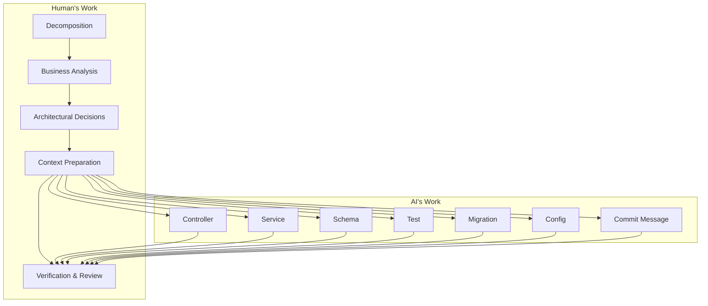
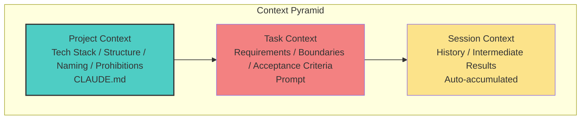
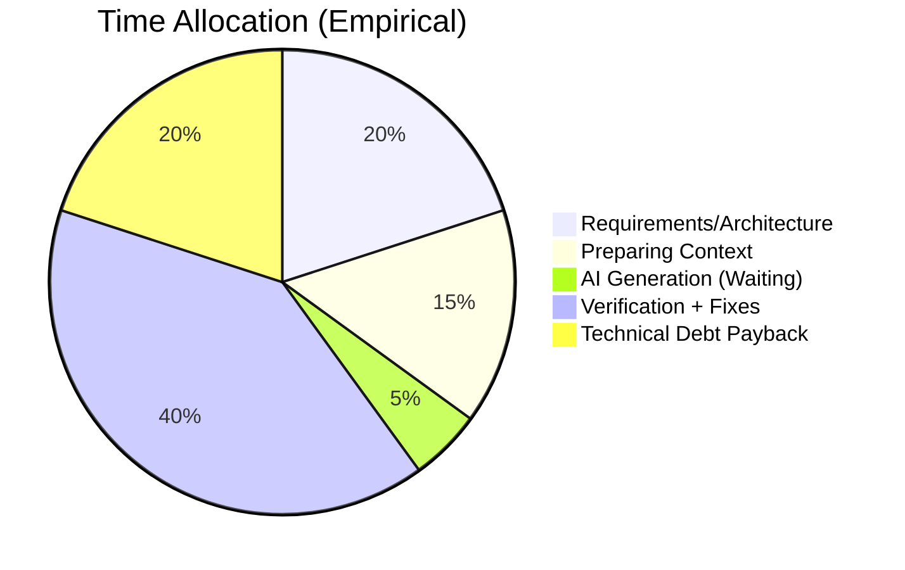
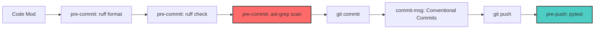

> I am not a native English speaker; this article was translated by Gemini.

> Based on the Vibe Coding Skeleton engineering practice.
> **Note**: For specific implementation details, refer to `CLAUDE.md`, `.pre-commit-config.yaml`, `ast-grep/`, `sgconfig.yml`, and `justfile` in this repository.

---

**TL;DR**: It's not about "letting AI write code," but "using engineering to ensure AI writes the right code."

---

### I. A Fact

#### 1.1 Data Impact

> A real project (anonymized), iterated for about 8 months, with over 1k+ commits.
>
> Aside from requirement decomposition, business analysis, architectural adjustments, and final acceptance—
> **The vast majority of the code was generated by AI, with humans responsible for decision-making and acceptance.**
>
> Today, we're not talking about whether AI can write code.
> We're talking about: **How to make AI write the right code.**

**Project Overview**:

| Metric | Value (Anonymized) |
|:---|:---:|
| Dev Cycle | ~8 Months |
| Total Commits | 1k+ |
| Active Days | 200+ |
| Avg Commits/Day | ~5 |
| Conventional Commits Compliance | >95% |

**Commit Type Distribution**:

| Type | Share | Description |
|:---|:---:|:---|
| feat | ≈40% | New Features |
| fix | ≈20% | Bug Fixes |
| refactor | ≈20% | Refactoring (including AI optimization) |
| test | ≈5% | Testing |
| others | remainder | chore/docs/perf, etc. |

#### 1.2 Role Shift

**Traditional Perception** vs. **Reality**:

| Traditional Perception | Reality |
|:---|:---|
| AI helps you write some code | AI generates most code; humans decide and accept |
| Human + AI Collaboration | Human commands, AI executes, Human accepts |
| Learning to use AI | Learning to verify AI and feed context |

**New Division of Labor**:



---

### II. Why It Works

#### 2.1 Context is King

**Core Formula**:

```
AI Coding Proficiency = Your Context Proficiency
```

**The Context Pyramid**:



**Project Context** is "invest once, benefit continuously"—it has the highest ROI. Spending time writing a good `CLAUDE.md` is the best investment you can make.

#### 2.2 Bottleneck Shift

**My Time Allocation**:



**Key Insight**: 40% of the time is spent "verifying," not "writing."

---

### III. How It's Done

#### 3.1 Project-level Context: CLAUDE.md

This project uses a ~300-line `CLAUDE.md` as an "AI Onboarding Manual."

**Why it works**: AI doesn't have to guess; it follows the specs directly.

#### 3.2 Automated Verification System

Code generated by AI must pass a quality pipeline.

**The Pipeline**:



##### ast-grep: Project-Specific Guardrails

AI doesn't know your project's unique constraints, but `ast-grep` will intercept them automatically.

**Example Rules (Excerpt)**:

| Rule (ast-grep id) | Intercepts What | Why |
|:---|:---|:---|
| no-match-case | `match/case` syntax | Cython compatibility |
| no-tempfile-delete-false | `NamedTemporaryFile(delete=False)` | Prevent leaks; reduce manual cleanup code |
| no-local-import-stdlib | Imports inside functions | Avoid hidden dependencies and duplication |

---

### IV. Boundaries and Stop-Loss

#### 4.1 The Sweet Spot vs. The Quagmire

It's not about "Can AI write it?"—AI can write anything. It's about "Is the verification cost too high?"

| Task | AI can write? | Verification Cost | Conclusion |
|:---|:---:|:---:|:---:|
| CRUD APIs | ✅ | Low (run tests) | ✅ Sweet Spot |
| Unit Tests | ✅ | Low (clear I/O) | ✅ Sweet Spot |
| Complex Logic | ✅ | High (needs domain knowledge) | ⚠️ Caution |
| Perf Tuning | ✅ | High (needs real metrics) | ❌ Quagmire |

#### 4.2 When to Give Up

| Signal | Action |
|:---|:---|
| Fails 3 times in a row | Write it yourself |
| > 5 mins explaining domain knowledge | Write it yourself |
| Repeats the same mistake | Write it yourself |

---

**Tools change, but our value in solving problems remains. I hope everyone can become the one who drives AI, rather than being driven by it.**
