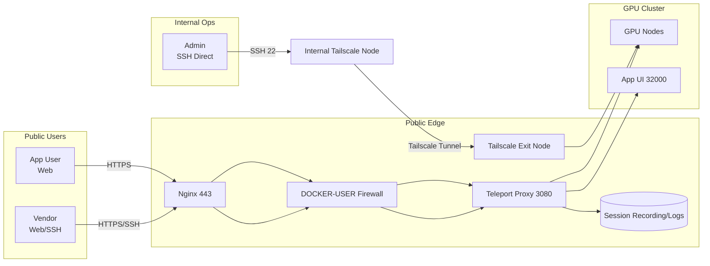

> I am not a native English speaker; this article was translated by AI.

Several DGX H800 nodes sit in a private network, and vendors occasionally need remote debugging access. The goals are clear:

1. Vendors must be able to connect and work.
2. Full session recording/auditing is required, but it should be "silent" (vendors shouldn't know they are being recorded).
3. Our internal team needs a privileged channel to bypass the bastion host and connect directly.

Final setup: **Teleport** for the bastion and auditing, **Tailscale** for internal connectivity and the ops bypass path. Below are the pitfalls and key configs.

---

### Architecture at a Glance



---

### Pitfall 1: Too Many Ports

Teleport defaults to opening several ports (3022-3080), which makes firewall rules painful. **Multiplexing** collapses it to a single port:

```yaml
# teleport.yaml
auth_service:
  proxy_listener_mode: multiplex
```

This uses ALPN to identify traffic types (HTTPS/SSH/Tunnel), all flowing through port 3080. One port is enough.

---

### Pitfall 2: Agent Installation Failures in Isolated Nodes

Installing the Teleport Agent on isolated GPU nodes requires a proxy. `yum`/`dnf` failed with certificate errors. The fix was to explicitly configure the proxy in the repo file:

```ini
# /etc/yum.repos.d/teleport.repo
[teleport]
proxy=http://[Bastion_VIP]:8888
```

---

### Pitfall 3: WebSocket Disconnections

When using Nginx to reverse proxy the Teleport Web Terminal, the page loads but the terminal disconnects immediately. Three Nginx settings are mandatory:

```nginx
proxy_pass https://127.0.0.1:3080;  # MUST use https
proxy_ssl_verify off;                # For self-signed certs
proxy_http_version 1.1;
proxy_set_header Upgrade $http_upgrade;
proxy_set_header Connection "upgrade";
```

---

### Pitfall 4: Docker Ports Bypassing iptables

This is the most dangerous one. Ports mapped by Docker bypass the `INPUT` chain and go straight through `DOCKER-USER`. My previous rules were useless, leaving 3080 wide open to the public internet.

Note: `-F` flushes the `DOCKER-USER` chain. In production, back it up first or use `-I` to insert.

The fix:

```bash
iptables -F DOCKER-USER
# Allow only localhost and Tailscale network
iptables -A DOCKER-USER -s 127.0.0.1 -p tcp --dport 3080 -j ACCEPT
iptables -A DOCKER-USER -s 100.64.0.0/10 -p tcp --dport 3080 -j ACCEPT
iptables -A DOCKER-USER -p tcp --dport 3080 -j DROP
```

---

### Pitfall 5: Nginx Pointing to VPN IP Caused Circular Dependency

Earlier, I configured Nginx to use the Tailscale VPN IP. If the VPN blipped, the management page went down.

Switching to `127.0.0.1` (localhost) ensures that if the VPN goes down, the management console is still accessible from the public network.

---

### Permissions Design

| Role | Access Method | Auditing |
|:---|:---|:---|
| Admin | SSH Port 22 + Ed25519 Key | None |
| Vendor | Web Terminal | Full recording (hidden from vendor) |

RBAC Tip: Strip the `audit` permission from the vendor's `restricted-dev` role to achieve "silent auditing."
Note: Removing `audit` only affects visibility of recordings/logs. It does not necessarily hide recording banners; this depends on your Teleport version and settings.

Two practical constraints:
1. Vendors access only via Teleport Web/SSH and do not need Tailscale.
2. Vendor roles constrain login users and visible nodes (label-based isolation).

```yaml
# Example: node labels (vendor name redacted)
labels:
  vendor: vendor-x
  env: prod
```

```yaml
# Example: role constraints (vendor login + visible nodes)
kind: role
spec:
  allow:
    logins: ["vendor-user"]
    node_labels:
      vendor: "vendor-x"
  deny:
    logins: ["root"]
```

---

### Core Configuration

**docker-compose.yml**

```yaml
services:
  teleport:
    ports:
      - '3080:3080'
      - '127.0.0.1:3025:3025'  # Management API local only
```

**teleport.yaml**

```yaml
proxy_service:
  public_addr: [teleport.example.com:443, 100.64.0.x:3080]
```

---

### App Access (Addendum)

**Expose apps (example)**

```yaml
app_service:
  enabled: "yes"
  apps:
  - name: app-ui
    uri: http://10.120.0.0:32000/
    public_addr: app-ui.example.com
```

**Proxy env conflict (503)**

If the node has `HTTP_PROXY`, Teleport may route to the proxy for internal services and return 503. Add `NO_PROXY` in systemd:

```ini
# /etc/systemd/system/teleport.service
Environment="NO_PROXY=localhost,127.0.0.1,10.0.0.0/8,100.64.0.0/10"
```

**Nginx Host passthrough header**

For multi-subdomain access, pass Host:

```nginx
proxy_set_header Host $host;
```

---

With this setup, vendors work in the Web UI, and internal ops use Tailscale for direct access. Session recordings are available at any time, while the cluster stays off the public internet.

Works for me.

---

```js
NOTE: I am not responsible for any expired content.
Created at: 2026-01-03T03:58:20+08:00
Updated at: 2026-01-03T05:55:29+08:00
Origin issue: https://github.com/ferstar/blog/issues/95
```
