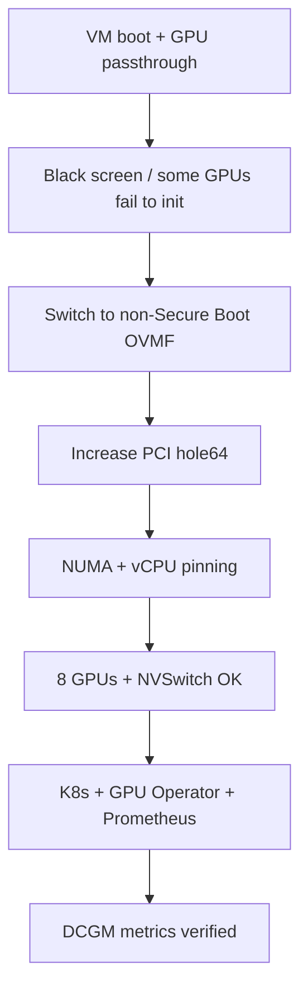

> I am not a native English speaker; this article was translated by AI.

This is a practical record of the troubleshooting path, with key fixes, config snippets, and verification steps so the same pitfalls are easier to avoid next time.

## Scenario and goals
- Host: GPU node, VM: `ubuntu_gpu` (KVM/libvirt, UEFI/OVMF)
- Goal: 8x H800 + 4x NVSwitch passthrough, single-node K8s + GPU Operator + Prometheus, DCGM metrics available

## Symptoms and fix path


### 1) Black screen and PCI resource shortage
- Symptom: no VNC output after passthrough, driver logs show `PCI I/O region invalid`
- Fix: use non-secure OVMF, enlarge PCI hole64

Key snippet:
```xml
<!-- OVMF non-secure -->
<loader readonly='yes' type='pflash'>/usr/share/edk2/ovmf/OVMF_CODE.cc.fd</loader>

<!-- Q35 PCIe 64-bit hole -->
<qemu:commandline>
  <qemu:arg value='-global'/>
  <qemu:arg value='q35-pcihost.pci-hole64-size=2048G'/>
</qemu:commandline>
```

### 2) IP unreachable (DHCP binding)
- Cause: NIC MAC changed, DHCP lease no longer matched
- Fix: restore old MAC, IP back to `192.168.122.146`

```bash
# old MAC
52:54:00:a9:a2:11
```

### 3) Resource tuning (memory + NUMA)
- Memory set to 256GB
- vCPU split and pinned to NUMA nodes; GPUs aligned by NUMA locality

```xml
<memory unit='KiB'>268435456</memory>
<currentMemory unit='KiB'>268435456</currentMemory>
```

## Verification (GPU / K8s / monitoring)
GPU:
```bash
nvidia-smi -L
nvidia-smi topo -m
nvidia-smi nvlink -s
```

K8s:
```bash
kubectl get nodes -o wide
kubectl get pods -A
```

Prometheus (DCGM metrics):
```bash
curl http://127.0.0.1:9090/api/v1/query?query=DCGM_FI_DEV_SM_CLOCK
```

## Key configs
### containerd proxy (no public internet)
```ini
# /etc/systemd/system/containerd.service.d/http-proxy.conf
[Service]
Environment="HTTP_PROXY=http://100.64.0.5:8888"
Environment="HTTPS_PROXY=http://100.64.0.5:8888"
Environment="NO_PROXY=127.0.0.1,localhost,10.0.0.0/8,172.16.0.0/12,192.168.0.0/16,100.64.0.0/10"
```

### GPU Operator + Prometheus
```bash
helm upgrade --install gpu-operator nvidia/gpu-operator \
  -n gpu-operator --create-namespace \
  --set driver.enabled=false --set dcgmExporter.enabled=true

helm upgrade --install kube-prometheus-stack prometheus-community/kube-prometheus-stack \
  -n monitoring --create-namespace
```

### DCGM metrics into Prometheus
```bash
# ServiceMonitor must match Prometheus release label
kubectl -n gpu-operator label servicemonitor nvidia-dcgm-exporter release=kube-prometheus-stack --overwrite
```

## Takeaways (reusable checklist)
- Check `pci-hole64-size` first for multi-GPU passthrough issues
- Secure Boot in OVMF can block multi-GPU bring-up; validate with non-secure OVMF first
- If DHCP goes weird, verify the MAC wasn’t changed
- For monitoring, DCGM Exporter must carry the same `release` label as Prometheus
