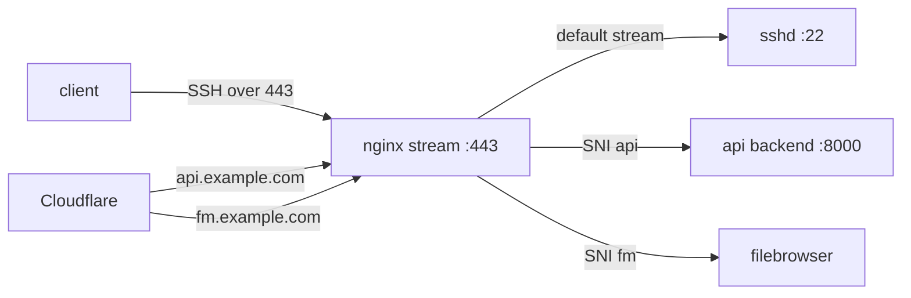

> I am not a native English speaker; this article was translated by AI.

This was not a migration. It was what happened after the migration, when a small VPS finally pushed back.

The symptoms looked like a network issue: the local SSH alias closed instantly, the provider web console got stuck at "connecting", and the API behind Cloudflare turned into a 521. The awkward part was that the proxy service on the same host still worked, so it was not a complete host failure. It also did not fit the usual suspects: floating IP, local TUN proxy, or SSH key problems.

After a reboot, SSH came back and I could inspect the machine. The conclusion was clear: 512MB RAM was too tight, and the system had hit repeated page allocation failures in the network receive path. Nginx stream, SSH, and the API entrypoint were all dragged into a half-broken state.

## Symptoms

SSH failed before key authentication:

```text
kex_exchange_identification: Connection closed by remote host
```

That detail mattered. The connection had reached the remote side, but SSH never got to normal authentication. So this was not a changed key, bad file permission, or dirty `known_hosts`.

The entrypoint design on this host is slightly indirect:



SSH, the API, and the file service all pass through Nginx stream. If Nginx, the kernel network stack, or local memory pressure goes sideways, the outside world sees it as "SSH is down" and "the API is down" at the same time.

## The real evidence

After the reboot, the useful kernel log keyword was not `sshd`. It was this:

```bash
journalctl -k --since "2026-06-13 00:00:00" | \
  egrep -i "page allocation failure|out of memory|oom|killed process"
```

Before the reboot, there had been repeated `page allocation failure` messages involving processes like:

- `containerd-shim`
- `containerd`
- `dockerd`
- `hysteria`
- `runc`
- `kswapd0`

The stack traces were concentrated in the receive path, with functions like `virtio_net`, `tcp_gro_receive`, and `skb_page_frag_refill`. So this was not just one application writing too many logs. Low memory had already started affecting how the kernel handled network packets.

That also explains why the failure looked so strange. A TCP port might still accept connections, and a UDP proxy might still appear alive, while SSH handshakes, Nginx stream forwarding, and API upstream traffic fail randomly under memory pressure.

## Round one: clean up the system and kernel

First, I put the package and kernel state back into something predictable.

The XanMod source was still using the old form:

```bash
deb [signed-by=/etc/apt/keyrings/xanmod-archive-keyring.gpg] http://deb.xanmod.org releases main
```

For Debian 13, I changed it to the codename-based source:

```bash
deb [signed-by=/etc/apt/keyrings/xanmod-archive-keyring.gpg] http://deb.xanmod.org trixie main
```

Then I installed the current x64v3 XanMod kernel:

```bash
apt update
apt install linux-xanmod-x64v3
reboot
```

After reboot:

```bash
uname -r
# 7.0.12-x64v3-xanmod1
```

Old kernels were removed as well, leaving only the current XanMod packages and avoiding stale boot entries:

```bash
apt autoremove --purge
apt clean
update-grub
```

I also cleaned journald and unused Docker objects:

```bash
journalctl --vacuum-time=7d
docker system prune -af
```

This did not remove Docker volumes. Business data should not be part of a cleanup shortcut.

## Round two: give 512MB RAM a fallback path

The machine has only about 454MiB of usable RAM. "Hope the applications behave" is not an operating model. The system needs defined escape routes when memory gets tight.

### Expand swap

I expanded swap to 2GB:

```bash
swapoff /swapfile
fallocate -l 2G /swapfile
chmod 600 /swapfile
mkswap /swapfile
swapon /swapfile
```

`/etc/fstab` stays simple:

```fstab
/swapfile none swap sw 0 0
```

### Change zswap to zstd

zswap was already enabled, but its default compressor was `lzo`. I checked that the kernel supported zstd:

```bash
grep -i zstd /proc/crypto
grep CONFIG_CRYPTO_ZSTD /boot/config-$(uname -r)
```

Runtime switch:

```bash
echo zstd > /sys/module/zswap/parameters/compressor
cat /sys/module/zswap/parameters/compressor
# zstd
```

Then I made it persistent in GRUB:

```bash
GRUB_CMDLINE_LINUX_DEFAULT="zswap.enabled=1 zswap.compressor=zstd net.ifnames=0 biosdevname=0"
update-grub
```

### Leave some room for network and memory pressure

I added `/etc/sysctl.d/99-lowmem-network-tuning.conf`:

```conf
vm.min_free_kbytes = 16384
vm.swappiness = 30
vm.vfs_cache_pressure = 100
net.core.netdev_max_backlog = 2500
```

I had tried a higher `vm.min_free_kbytes` first, but on a 512MB host it was too aggressive and squeezed user-space memory. Around 16MB is closer to what this machine can tolerate.

## Round three: decide what should die first

The worst low-memory behavior is everyone fighting for memory until the kernel randomly kills something critical. I wanted the priorities to be explicit.

### Protect entrypoint services

I added a systemd drop-in for `ssh`, `nginx`, and `supervisor`:

```ini
[Service]
OOMScoreAdjust=-700
```

In practice, `sshd` was already at `-1000`, while Nginx, Supervisor, and gunicorn were at `-700`:

```bash
for pid in $(pgrep -f "sshd|nginx|supervisord|gunicorn"); do
  printf "%s score=%s adj=%s cmd=%s\n" \
    "$pid" \
    "$(cat /proc/$pid/oom_score)" \
    "$(cat /proc/$pid/oom_score_adj)" \
    "$(tr '\0' ' ' </proc/$pid/cmdline)"
done
```

One operational note: if SSH enters through Nginx stream, restarting `nginx` will cut the SSH session. Reload if possible, or be ready to reconnect.

### Limit containers

The proxy and file-service containers got resource limits:

```yaml
services:
  hysteria:
    mem_limit: 96m
    memswap_limit: 160m
    pids_limit: 128
    oom_score_adj: 500
```

The final limits were:

| Container | mem_limit | memswap_limit | pids_limit | oom_score_adj |
| --- | ---: | ---: | ---: | ---: |
| hysteria | 96m | 160m | 128 | 500 |
| hysteria2 | 96m | 160m | 128 | 500 |
| tuic-server | 64m | 128m | 128 | 500 |
| filebrowser | 96m | 160m | 128 | 500 |

One small trap: the Debian-packaged Docker on this host is `26.1.5+dfsg1`, and `docker update` does not support changing `--oom-score-adj` dynamically:

```bash
docker update --oom-score-adj 500 hysteria
# unknown flag: --oom-score-adj
```

So `oom_score_adj` belongs in compose, followed by a container recreation:

```bash
docker compose up -d --force-recreate
```

Verification:

```bash
docker inspect hysteria hysteria2 tuic-server filebrowser \
  --format "{{.Name}} OOM={{.HostConfig.OomScoreAdj}} Mem={{.HostConfig.Memory}} Swap={{.HostConfig.MemorySwap}} Pids={{.HostConfig.PidsLimit}}"
```

### Add earlyoom

Finally, I added earlyoom so something acts before the kernel reaches a real OOM:

```bash
apt install earlyoom
```

`/etc/default/earlyoom`:

```bash
EARLYOOM_ARGS="-m 10,5 -s 20,10 -r 300 --prefer '(^|/)(hysteria|tuic-server|filebrowser)( |$)' --avoid '(^|/)(sshd|sshd-session|nginx|supervisord|gunicorn|systemd|dockerd|containerd)( |:|$)'"
```

This does not conflict with systemd `OOMScoreAdjust`. `OOMScoreAdjust` changes `/proc/*/oom_score`, and earlyoom also uses those scores by default. `--avoid` is an extra "do not actively kill these entrypoint services" layer.

The service log shows the policy clearly:

```text
Preferring to kill process names that match regex '(^|/)(hysteria|tuic-server|filebrowser)( |$)'
Will avoid killing process names that match regex '(^|/)(sshd|sshd-session|nginx|supervisord|gunicorn|systemd|dockerd|containerd)( |:|$)'
sending SIGTERM when mem avail <= 10.00% and swap free <= 20.00%,
        SIGKILL when mem avail <=  5.00% and swap free <= 10.00%
```

## Stop logs from eating the disk

The root disk is small too, so journald and Docker logs need limits.

`/etc/systemd/journald.conf.d/99-vps-limits.conf`:

```ini
[Journal]
SystemMaxUse=128M
SystemKeepFree=512M
RuntimeMaxUse=16M
MaxRetentionSec=7day
RateLimitIntervalSec=30s
RateLimitBurst=1000
```

Docker daemon defaults:

```json
{
  "log-driver": "json-file",
  "log-opts": {
    "max-size": "5m",
    "max-file": "2"
  }
}
```

I also disabled UFW logging:

```bash
ufw logging off
```

There had been plenty of scan noise producing UFW BLOCK logs. On a small disk and small memory host, that noise is not worth keeping.

## Final checks

The closing checks looked like this:

```bash
uname -r
# 7.0.12-x64v3-xanmod1

apt list --upgradable
# Listing...

systemctl --failed --no-pager
# 0 loaded units listed.

systemctl is-active earlyoom ssh nginx supervisor docker containerd
# active
# active
# active
# active
# active
# active
```

Memory state:

```text
Mem: 454Mi total, 235Mi available
Swap: 2.0Gi total, about 271Mi used
```

Entrypoint checks:

```bash
ssh VPS_ALIAS 'echo ok'
curl -sS -o /dev/null -w '%{http_code}\n' https://api.example.com/
curl -sS -o /dev/null -w '%{http_code}\n' https://fm.example.com/
```

SSH worked. The API returned an application-level 404, and the file service returned 200. The API 404 was a routing result, not Cloudflare 521 and not a dead upstream.

I also checked the kernel log after the tuning:

```bash
journalctl -k --since "2026-06-13 06:28:32 UTC" --no-pager | \
  egrep -i "out of memory|oom-kill|page allocation failure|killed process"
```

No new OOM or page allocation failures showed up.

## Note to self

The main lesson: a 512MB VPS can run services, but it cannot be left on defaults.

This matters even more when SSH enters through Nginx stream and the API shares the same 443 entrypoint. Entrypoint services must be protected. The processes that should give way first are proxy containers, file services, and temporary jobs, not `sshd`, `nginx`, or the API supervisor.

Of course, all of this only pushes the boundary of 512MB a little further. The real fix is still upgrading to 1GB RAM. Low-end VPS tuning is useful, but it is not magic.
