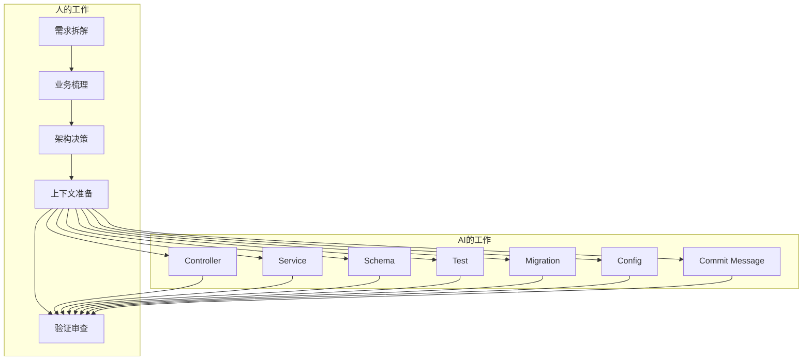
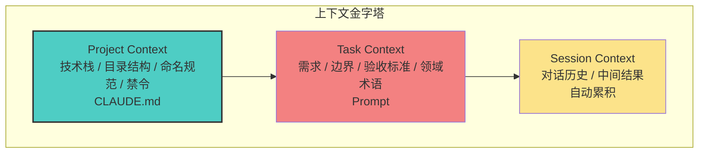
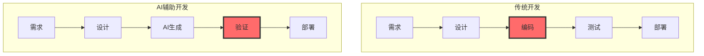
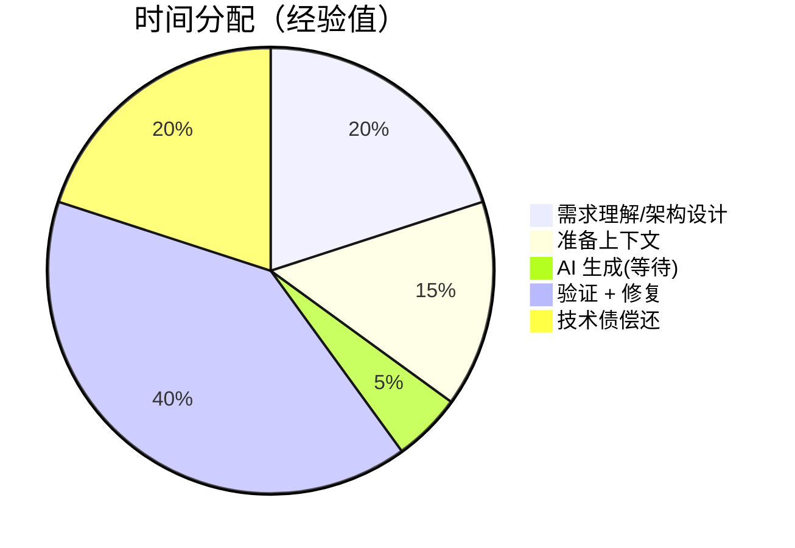
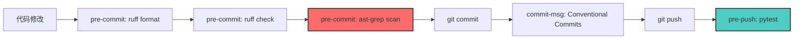
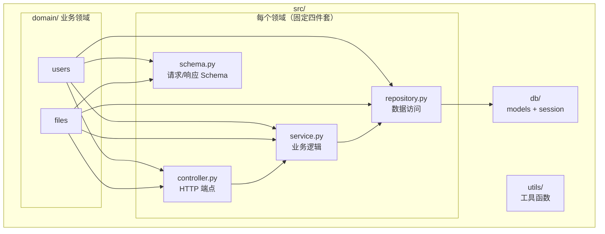
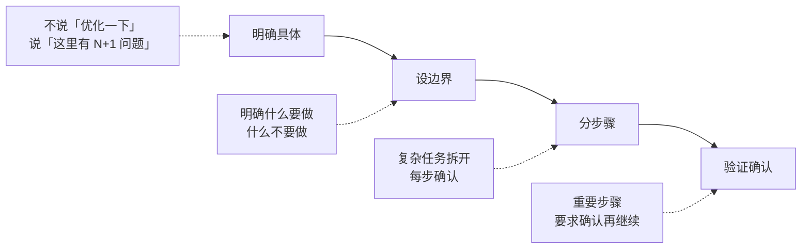
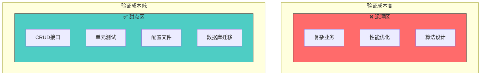
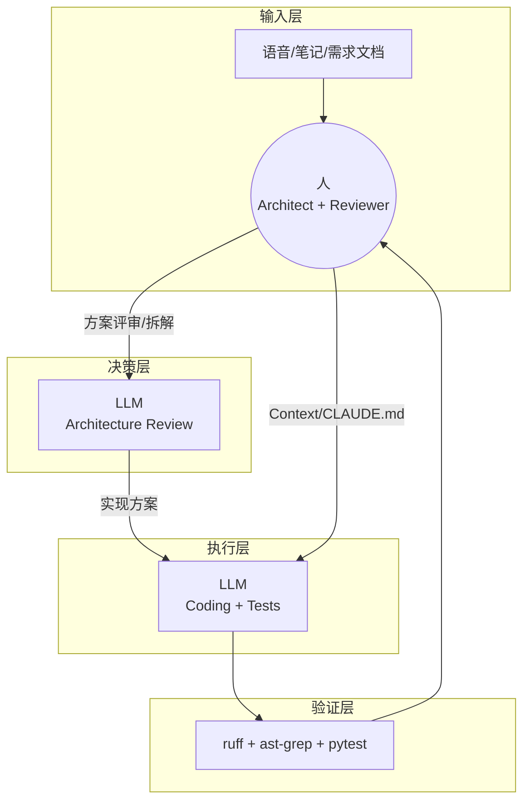

# Vibe Coding 实战：当代码不再需要手写

> 基于 Vibe Coding Skeleton 的工程实践
> **对齐说明**：涉及到具体落地细节时，以本仓库 `CLAUDE.md` / `.pre-commit-config.yaml` / `ast-grep/` / `sgconfig.yml` / `justfile` 为准。

---

**TL;DR**：不是“让 AI 写代码”，而是“用工程化让 AI 写对代码”。

---

### 一、一个事实

#### 1.1 数据冲击

> 某个真实项目（已脱敏），持续迭代约 8 个月，累计 1k+ 次提交。
>
> 除了需求拆解、业务梳理、架构调整与最终验收——
> **绝大多数代码由 AI 生成，人负责决策与验收。**
>
> 今天不聊 AI 能不能写代码。
> 聊的是：**怎么让 AI 写对代码。**

**项目概况**：

| 指标 | 数值（脱敏） |
|:---|:---:|
| 开发周期 | 约 8 个月 |
| 总提交 | 1k+ commits |
| 活跃天数 | 200+ 天 |
| 活跃日均 | ~5 commits |
| Conventional Commits 规范率 | >95% |

**提交类型分布**：

| 类型 | 占比 | 说明 |
|:---|:---:|:---|
| feat | ≈40% | 新功能 |
| fix | ≈20% | Bug 修复 |
| refactor | ≈20% | 重构（含 AI 代码优化） |
| test | ≈5% | 测试 |
| 其他 | 其余 | chore/docs/perf 等 |

**开发阶段演进（抽象）**：

| 阶段 | 特征 | 重点 |
|:---|:---|:---|
| 功能冲刺期 | `feat` 占比更高 | 快速验证主链路 + 质量门禁 |
| 稳定迭代期 | `fix/refactor` 上升 | 自动化回归 + 边界/性能验证 |

#### 1.2 角色转变

**传统认知** vs **实际情况**：

| 传统认知 | 实际情况 |
|:---|:---|
| AI 帮你写一部分代码 | AI 生成大部分代码，人负责决策与验收 |
| 人 + AI 协作 | 人指挥，AI 执行，人验收 |
| 学会用 AI | 学会验 AI、学会喂上下文 |

**新的分工模式**：



**角色定义**：

| 角色 | 职责 | 不可替代性 |
|:---|:---|:---:|
| 产品经理 | 需求拆解、优先级 | ⭐⭐⭐⭐⭐ |
| 架构师 | 技术选型、模块划分 | ⭐⭐⭐⭐⭐ |
| QA | 验证、边界条件 | ⭐⭐⭐⭐ |
| ~~Coder~~ | ~~写代码~~ | ~~AI 替代~~ |

---

### 二、为什么能做到

#### 2.1 上下文为王

**核心公式**：

```
AI 写代码的水平 = 你提供上下文的水平
```

**更完整的版本**：

```
AI 交付质量 = 上下文质量 × 验证自动化 × 任务适配度
```

没有验证，输出只能算草稿；任务不适配，验证成本会爆炸。

**上下文三层模型**：



**各层级详解**：

| 层级 | 核心问题 | 具体内容 | 载体 | 投入 |
|:---|:---|:---|:---|:---|
| **Project** | 这个项目怎么玩？ | 技术栈、目录约定、命名规范、零容忍规则、常用命令 | CLAUDE.md | 一次性 |
| **Task** | 这次要做什么？ | 功能需求、边界条件、不要做什么、相关领域术语 | Prompt | 每任务 |
| **Session** | 刚才聊了什么？ | 会话历史、AI 的中间输出、已确认的决策 | 自动 | 无 |

**投资回报**：

```
投入产出比：Project >> Task >> Session

Project：8h 投入 → 所有任务受益（复利）
Task：5-10min → 当次任务
Session：0 → 当次对话
```

**结论**：Project Context 是"一次投入，持续受益"，复利最高。把精力花在写好 CLAUDE.md 上，是 ROI 最高的投资。

#### 2.2 瓶颈转移

**开发流程对比**：



**我的时间分配**：



**关键洞察**：
- 40% 时间在「验」，不是「写」
- 验证/修复相关的投入往往不低于“写新功能”
- 这印证了瓶颈从「写」转到「验」

---

### 三、怎么做到的

#### 3.1 项目级上下文：CLAUDE.md

本项目用一个约 300 行的 `CLAUDE.md` 作为「AI 入职手册」。

> **注**：不同 AI 工具对“上下文文件”的文件名有偏好（例如 `CLAUDE.md`、`.cursorrules`、`AGENTS.md`）。本质都是同一件事：把项目规则写成机器可读的入职手册。

**核心结构**：

```markdown
# CLAUDE.md

## Project Overview        # 项目是干什么的
## Technology Stack        # 技术栈：Litestar + PostgreSQL + Redis + OpenDAL + Celery
## Basic Rules             # 基本规则：先激活 venv，用 uv 管理依赖
## Development Commands    # 常用命令：just lint, just test
## Architecture Overview   # 架构：DDD 分层，src/domain/ 下按业务组织
## Coding Style            # 风格：ruff 格式化，150 字符行宽
## Testing Guidelines      # 测试：pytest（fail-fast，warnings-as-errors）
## CLI Commands            # CLI：litestar database upgrade, litestar run
```

**为什么有效**：AI 不用猜，直接按规范来。

##### 案例：ast-grep 如何拦截 AI 的坏习惯

**需求**：写一个处理 PDF 临时文件的函数

**AI 输出**（常见模式）：

```python
import tempfile
from pathlib import Path

def process_pdf(content: bytes) -> str:
    # 使用 delete=False 以便后续处理
    with tempfile.NamedTemporaryFile(suffix=".pdf", delete=False) as tmp:
        tmp_path = Path(tmp.name)
        tmp.write(content)

    try:
        result = parse_pdf(tmp_path)
        return result
    finally:
        tmp_path.unlink(missing_ok=True)  # 手动清理
```

**问题**：
- `delete=False` 强迫引入手动清理逻辑，代码更长、维护成本更高
- 这类清理逻辑一旦遗漏/写错（例如忘记 `try/finally`），就会引入临时文件泄漏
- 同类代码越多，review 与一致性成本越高

**ast-grep 拦截**：

```bash
$ git commit -m "feat: add pdf processor"
error[no-tempfile-delete-false]: NamedTemporaryFile with delete=False is forbidden
  --> src/utils/pdf.py:6:10
   |
 6 |     with tempfile.NamedTemporaryFile(suffix=".pdf", delete=False) as tmp:
   |          ^^^^^^^^^^^^^^^^^^^^^^^^^^^^^^^^^^^^^^^^^^^^^^^^^^^^^^^^
```

**修复后**：

```python
def process_pdf(content: bytes) -> str:
    with tempfile.NamedTemporaryFile(suffix=".pdf") as tmp:  # 默认 delete=True
        tmp_path = Path(tmp.name)
        tmp.write(content)
        tmp.flush()  # 确保写入磁盘

        result = parse_pdf(tmp_path)
        return result
    # 退出 with 块时自动清理，无泄漏风险
```

**关键点**：不是靠 AI "自觉遵守" CLAUDE.md，而是靠 ast-grep **强制拦截**。AI 可能还是会犯错，但错误代码无法通过 pre-commit 进入代码库。

#### 3.2 自动化验证体系

AI 生成的代码必须过质检流水线：门禁不过，就不应该进入主分支（至少先别推送/合入）。

本仓库示例把门禁分布在 `pre-commit` / `commit-msg` / `pre-push` 三个阶段。

**验证流水线**：



**pre-commit 核心配置**：

| Hook（id） | 作用 | 阶段 |
|:---|:---|:---:|
| ruff-format | 代码格式化 | pre-commit |
| ruff | 静态检查 + 自动修复 | pre-commit |
| ast-grep-lint | 项目特定规则 | pre-commit |
| conventional-pre-commit | 提交信息规范（Conventional Commits） | commit-msg |
| pytest | 单元测试 | pre-push |

##### ast-grep：项目特定的 AI 防护栏

AI 不知道项目的特殊约束，但 ast-grep 会自动拦截。

**本仓库示例规则（节选）**：

| 规则（ast-grep id） | 拦截什么 | 为什么 |
|:---|:---|:---|
| no-match-case | `match/case` 语法 | Cython 兼容性 |
| no-tempfile-delete-false | `NamedTemporaryFile(delete=False)` | 防止临时文件泄漏，减少手写清理逻辑 |
| no-global-src-import-in-cli | `**/cli.py` 全局导入 `src.*` | 避免启动副作用/循环依赖，CLI 更轻 |
| no-global-src-import-in-tests | 测试文件全局导入 `src.*`（常量除外） | 提升隔离性，减少副作用 |
| no-local-import-in-production-code | 生产代码里的“局部导入” | 依赖可见，便于静态检查/审查 |
| no-local-import-stdlib-third-party | 函数内导入标准库/三方包 | 避免隐藏依赖与重复导入 |

> 规则定义在 `ast-grep/rules/`，由 `sgconfig.yml` 加载，并通过 `.pre-commit-config.yaml` 在提交前自动执行。

##### 踩坑实录

**案例：match/case 事件**

```python
# AI 生成了 Python 3.10 的 match/case
match value:
    case 1:
        return "one"
    case _:
        return "other"
```

- Cython 编译失败
- 人工 review 没发现
- 教训：写了 ast-grep 规则永久拦截

**实际效果**：AI 生成了 `match/case`？提交时直接报错，不用等人工 review。

##### ROI

| 投入 | 回报 |
|:---|:---|
| 配置 pre-commit（2h） | 每次提交自动检查 |
| 写 ast-grep 规则（4h） | 防止 AI 犯特定错误 |
| 维护 CLAUDE.md（持续） | AI 输出质量提升 |

**核心观点**：自动化验证是信任 AI 的前提。

#### 3.3 标准化设计

**标准化 = AI 友好**。模式越固定，AI 越准确。

##### DDD 分层



##### 命名规范

| 类型 | 后缀 | 示例 |
|:---|:---|:---|
| Controller | `*Controller` | `UserController` / `FileController` |
| Service | `*Service` | `UserService` / `FileService` |
| Repository | `*Repository` | `UserRepository` / `FileRepository` |
| Schema | `*Request/*Response` | `LoginRequest` / `UserResponse` / `FileResponse` |
| 模块 | snake_case | `users` / `files` |
| 函数 | snake_case | `get_user_by_id` |

##### 目录约定（与本仓库一致）

```text
src/domain/
  users/
    controller.py
    service.py
    repository.py
    schema.py
  files/
    controller.py
    service.py
    repository.py
    schema.py
```

#### 3.4 提示词工程

##### 分步确认模式

```
我需要开发 [功能]。请按以下步骤：
1. 先读相关代码了解架构
2. 制定实现计划
3. 实现核心功能
4. 写测试
每完成一步暂停等我确认。
```

**为什么有效**：复杂任务拆成小步，每步可回退，减少返工。

##### 常用技巧

| 技巧 | 说明 |
|:---|:---|
| `@文件路径` | 精确引用文件，避免 AI 猜错 |
| `/clear` | 清理上下文，保持对话聚焦 |
| `/compact` | 压缩历史，释放 token |
| 先要计划 | 先让 AI 输出实现计划/验收点，再进入编码 |

> 注：`/clear` / `/compact` 这类命令属于“工具能力”，不同客户端可能不同；核心目的是降噪、聚焦、降低返工。

##### 核心原则



---

### 四、边界与止损

#### 4.1 甜点区 vs 泥潭

**核心认知**：不是「AI 能不能写」—— AI 都能写。是「验证成本高不高」。



**判断标准**：

| 任务 | AI 能写？ | 验证成本 | 结论 |
|:---|:---:|:---:|:---:|
| CRUD 接口 | ✅ | 低（跑测试） | ✅ 甜点 |
| 单元测试 | ✅ | 低（输入输出明确） | ✅ 甜点 |
| 配置文件 | ✅ | 低（格式固定） | ✅ 甜点 |
| 数据库迁移 | ✅ | 低（结构化） | ✅ 甜点 |
| 复杂业务 | ✅ | 高（需领域知识） | ⚠️ 谨慎 |
| 性能优化 | ✅ | 高（需实测） | ❌ 泥潭 |
| 算法设计 | ✅ | 高（需理解） | ❌ 泥潭 |

##### 案例：性能优化的正确姿势（脱敏）

**案例：N+1 查询优化**

**问题**：测试环境某列表接口响应从百毫秒级飙到秒级。

**错误做法** — 让 AI 在缺少数据的情况下“猜”：

```
我：这个接口太慢了，帮我优化
AI：加预加载 / 加缓存 / 加索引...（缺少证据，很可能无效）
```

**正确做法** — 先把“运行时事实”拿出来：

```
1. 人：在测试环境执行 EXPLAIN (ANALYZE, BUFFERS)，拿到查询计划
2. AI（分析型）：根据计划定位瓶颈（例如某子查询导致重复扫描）
3. 人：确认改写思路 + 需要的索引/迁移策略
4. AI（执行型）：生成代码 + 迁移脚本 + 对应测试
5. 人：跑 `just test` 并做简单压测对比
```

**结果**：通常能把“秒级”拉回到“百毫秒级”（具体数字因业务而异）。

**关键洞察**：

| 阶段 | 负责人 | 为什么 |
|:---|:---|:---|
| 获取运行时证据 | 人 | 需要环境访问与判断“该怀疑什么” |
| 分析与归因 | AI | 有数据就能更高效定位与总结 |
| 落地与验证 | AI + 人 | AI 写代码，人做最终验收 |

**教训**：不是“AI 不会优化”，而是“AI 不能替你拿到运行时数据”。

#### 4.2 放弃阈值

| 信号 | 行动 |
|:---|:---|
| 改 3 次还不对 | 自己写 |
| 解释 > 5 分钟领域知识 | 自己写 |
| AI 反复犯同样错误 | 自己写 |
| 安全敏感逻辑 | 自己写 + 仔细审查 |

**核心**：设止损线，别在泥潭里死磕。

#### 4.3 AI 常见错误（真实案例）

##### 1. 过度简化 — 破坏隐含逻辑

```python
# AI "简化"前（正确）
if server_session_id != request.session["id"].encode():

# AI "简化"后（错误）
if server_session_id != request.session["id"]:
# bytes vs str 比较，永远不相等，所有用户被踢出登录
```

**后果**：用户认证失败，需回滚

##### 2. 遗漏关键调用 — 上下文不足

```python
# AI 生成的代码
async def update_user_email_task(session, repo, user_id: int, email: str):
    await repo.update_email(user_id, email)
    # 忘记 await session.commit() ← 更新不会落库
    return {"status": "success"}
```

**后果**：数据库状态未持久化，任务状态丢失

##### 3. 忽略项目约定 — 不知道特殊规则

```python
# AI 在 CLI 文件里写了全局导入
from src.domain.users.service import UserService  # ❌ 违反规则

# 应该用局部导入
def create_user():
    from src.domain.users.service import UserService  # ✅
```

**后果**：CLI 启动慢，循环依赖风险

---

**应对策略**：

| 错误类型 | 检测方式 | 自动化程度 |
|:---|:---|:---:|
| 静态问题（语法/风格/禁令） | ruff + ast-grep（pre-commit） | ✅ 全自动 |
| 行为问题（遗漏调用/边界条件） | pytest（单元/集成） | ⚠️ 需要补测试 |
| 运行时问题（性能/安全） | 运行时数据 + 人工审查 | ❌ 高成本 |

**原则**：能自动拦截的，不靠人工 review。

---

### 五、行动清单

#### 立即可做（1天内）

- [ ] 创建 CLAUDE.md，写清技术栈、架构、规范
- [ ] 固化最小验证闭环（例如 `just lint` / `just test`），让“跑一遍验证”成本接近 0
- [ ] 配置 pre-commit hooks（ruff + ast-grep + Conventional Commits 校验 + pre-push pytest）
- [ ] 识别项目中的甜点区任务（CRUD / 测试 / 迁移 / 配置）

#### 中期投入（1周内）

- [ ] 写 1-3 条最痛的 ast-grep 规则，拦截项目特定错误（零容忍）
- [ ] 建立提示词模板库
- [ ] 完善测试覆盖率

#### 长期建设

- [ ] 持续更新 CLAUDE.md
- [ ] 积累甜点区和泥潭案例
- [ ] 团队分享最佳实践

---

### 六、房间里的大象

> 如果你只关心“怎么落地”，建议先看「五、行动清单」和「附录 A：本仓库可复用资产」。

我知道有人听完会想：

> "如果代码都 AI 写了，我算什么？"

这个问题值得正面回答。

#### 6.1 你的担忧是合理的

| 担忧 | 回应 |
|:---|:---|
| "主要由 AI 生成"是不是 KPI 营销？ | 是，也不是。Prompt 工程、需求拆解、架构决策、验收验证——这些都是编程，只是换了语言。"主要由 AI 生成"强调的是"不手写代码"，不是"人不参与"。 |
| Junior 怎么练手？ | 可能更需要通过阅读优秀开源项目、复盘 AI 的错误来反向学习，而不是靠写 CRUD 堆时长。 |
| Review AI 代码很累 | 对。读别人的代码本来就累，读 AI 的更累——因为它"看起来对"。40% 时间在验，不是吹的。 |
| 效率提升 = 裁员信号？ | 短期是优化人效，长期取决于业务是否扩张。 |

#### 6.2 几点澄清

**坏了，我成替身了**

换个视角：你不是 AI 的秘书，**AI 是你的实习生**。

- 实习生能干活，但你得告诉他干什么
- 实习生会犯错，你得 Review
- 实习生干得好，功劳算你的

区别是：这个实习生不睡觉、不抱怨、不要工资，而且你可以同时带 10 个。

**门槛降低了吗？**

没有。门槛**转移**了——从"会写代码"转移到"理解系统 + 会验证"。

讽刺的是：**AI 时代对工程师的要求更高了，不是更低了**。

#### 6.3 最诚实的回答

> "如果我还没成为架构师，是不是就直接被淘汰了？"

诚实的回答：**可能是**。

但这不是 AI 带来的新问题——这是软件行业一直存在的问题：

- 35 岁危机
- "写 CRUD 能写一辈子吗"
- "不往上走就等着被优化"

AI 只是把这个问题**加速暴露**了。

#### 6.4 如果你感到焦虑

```
1. 承认焦虑是合理的
2. 但焦虑不解决问题
3. 要么卷（学 Prompt、学架构、往上走）
4. 要么换赛道（AI 不擅长的领域）
5. 要么接受（成为"AI 协作者"，放下对"手写代码"的执念）
```

**今天的分享不是要告诉你"你必须这样做"，而是分享一种可能性。**

**工具在变，但我们解决问题的核心价值没变。希望大家都能成为那个驾驭 AI 的人，而不是被 AI 驾驭的人。**

#### 6.5 认知带宽：那个没人说的瓶颈

前面说"40% 时间在验"，但没说清楚：**为什么验这么累？**

答案是：**算力可扩展，认知带宽不可扩展。**

| 维度 | AI (硅基) | 人 (碳基) |
|:---|:---|:---|
| 上下文窗口 | 4K → 1M token | 7±2 单位（锁死） |
| 切换成本 | 毫秒级 | 分钟级 + 精神力损耗 |
| 能源 | 电（便宜） | 多巴胺（不可再生） |

**后果**：
- AI 一秒吐出 3000 行代码，你要用 7 个单位的缓存去审
- 每次被打断（模型报错/追问/工具弹窗），你的"架构思路 KV Cache"就被清空
- 一天下来，没写几行代码，却比写 1000 行还累——这叫 **Decision Fatigue**

**应对策略**：

| 策略 | 做法 |
|:---|:---|
| 异步化 | 任务丢进队列，批处理结果，不要实时盯着 AI 输出 |
| AI 过滤 AI | 让另一个模型先做 Review/风险摘要，你只看高风险点 |
| 降噪 | 要求 AI 输出 TL;DR，不看中间思考过程 |

**一句话**：效率提升有天花板，天花板就是你的生物学极限。

> 硅基把 CPU 烧红了，换个散热器就行。
> 碳基把精神力烧干了，那叫 Burnout，重启都难。

---

### 附录 A：本仓库可复用资产（落地对照）

这套方法论最怕“听懂了，但落不了地”。本仓库把关键资产都固化成了文件与命令：

- `CLAUDE.md`：项目级上下文（技术栈、目录结构、零容忍规则、常用命令）
- `.pre-commit-config.yaml`：提交前质量门禁（ruff/ast-grep/commit-msg 校验等）
- `sgconfig.yml` + `ast-grep/rules/`：项目特定规则（把“隐含约定”变成“可执行约束”）
- `justfile`：把常用验证命令固化成 `just lint` / `just test`
- `docs/ai-collaboration.md`：提示词模板与任务分区（甜点区/谨慎区/止损线）

一个最小闭环（示例）：

```bash
source .venv/bin/activate
uv sync --group=dev
just lint
just test
```

> 注：如果测试依赖数据库/缓存等外部服务，请按 `README.md` / `CLAUDE.md` 完成环境配置后再运行。

---

### 附录 B：多模型协作（抽象版）



**核心原则**：人是决策节点，AI 是执行层；验证体系是信任的前提。

### 附录 C：关于本文档（一种自举）

本文档由 AI 生成 —— 这本身就验证了文档的核心论点：

> 代码不用写了，但需求、架构、验证——一个都不能少。

**分工**：

| 角色 | 贡献 |
|:---|:---|
| 人 | 论点、结构、案例筛选、审校 |
| AI | 内容生成、格式排版、润色 |

**用 AI 写「如何用 AI」，是最好的证明。**


---

```js
NOTE: I am not responsible for any expired content.
Created at: 2025-12-31T21:46:31+08:00
Updated at: 2026-01-03T03:57:03+08:00
Origin issue: https://github.com/ferstar/blog/issues/94
```
