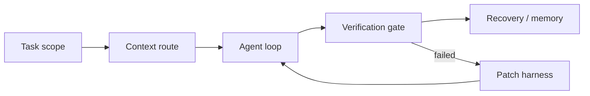

这篇是一次组内分享的文字版，配套 slides 放在这里：

[从 Vibe Coding 到 Harness Engineering](/slides/harness-engineering-ai-coding/)

  <iframe src="/slides/harness-engineering-ai-coding/" title="从 Vibe Coding 到 Harness Engineering" style="position:absolute;inset:0;width:100%;height:100%;border:0;" loading="lazy" allowfullscreen></iframe>

前一阶段我更关心一件事：AI 到底能不能承担大部分编码工作。

结论已经比较明确。只要项目上下文、质量门禁和验证流程能跟上，AI 生成的代码可以稳定进入工程流程。人真正花时间的地方逐渐从“写”转到“验”：需求拆解、架构判断、上下文组织、边界验证、失败处理。

最近这轮实践往前走了一步。问题不再停留在“怎么写 prompt”，而是整个工作流能不能支撑长周期任务。

### 变化在哪里

早期的 Vibe Coding 解决了入口问题：把需求讲清楚，把项目规则写进 `AGENTS.md` / `CLAUDE.md`，让测试、lint、review 接住模型输出。

这套东西仍然有用，但它更像单次任务的工程化。任务一长，新的问题会冒出来：

- 上下文越塞越多，模型开始抓不到重点
- 失败后继续重试，容易把问题越修越偏
- 外部资料没查清，策略靠直觉拍
- 跑了很多轮，人醒来不知道哪些变化该保留
- 用户拒绝、权限阻断、空输出这类状态没有明确停止语义

所以我现在更愿意把这套方法叫做 **Harness Engineering**。重点是给 AI 外面套一层工程轨道，让任务可执行、结果可验证、失败可恢复。

### 我现在会先管四件事

第一件事是任务边界。

中型任务开始前，至少写清楚 `done when`、`out of scope`、改动面和验证命令。这里不需要长文档，很多时候 5 行就够。关键是让执行侧知道什么时候该停。

第二件事是上下文路由。

`AGENTS.md` 不适合写成百科全书。更适合做索引：这个项目的规则是什么，入口在哪里，验证命令是什么，哪些事情不能碰，下一层文档去哪找。真正的长上下文按需读，不整包塞回会话。

第三件事是验证闭环。

我现在默认按这个顺序推进：

1. Read：读 README、AGENTS、旧文、关键实现
2. Search：用 `ace`、`rg`、`ast-grep`、`nmem`、Exa 找证据
3. Change：小范围 patch，少做顺手重构
4. Verify：先跑窄测试，再按风险扩大
5. Record：把反复踩坑写回规则、测试或 memory

这条顺序看起来普通，但它能压住很多失控场景。先读和先查，能减少“模型脑补”；先窄测，能避免一次改太大后不知道哪一步坏了。

第四件事是失败处理。

失败后先判断类型：停、重试、补 harness，还是记忆沉淀。

| 类型 | 什么时候用 | 处理方式 |
|:---|:---|:---|
| 停 | 用户拒绝、权限阻断、有副作用、重复空转 | 断开 loop，交还控制权 |
| 重试 | 网络抖动、参数可修、读取失败且无副作用 | 小步重试，保留日志 |
| 补 | 同类错误第二次出现 | 补测试、规则、脚本或日志 |
| 记 | 以后还会遇到 | 留触发条件、验证命令和证据入口 |

我以前会把很多失败都当成“再试一次”。现在更谨慎一点。能重试的问题才重试，该停止的问题必须停止。

### 外部资料怎么进来

这轮工作流里，Exa 或类似 web search 工具的角色也变得更明确。

我一般不查宏观趋势，更多查具体工程问题：

- 超时应该设多少
- 失败要不要重试
- 默认策略怎么拆
- 主流工具给了哪些边界
- 真实 issue 里暴露了哪些失败样本

查完不会照搬。外部资料只负责给参照系，最后还要回到当前 repo 的约束里做取舍。真正有用的结论，要落到 spec、项目规则、测试或脚本里。否则下次还会重新查一遍。

### Autoresearch 和 Ralph Loop

Autoresearch 更适合有明确指标的长循环。先给 agent 一个目标、一个 guard、一个验证命令，每轮只允许一个可回滚变化。

Ralph Loop 我现在理解成“持久单负责人执行”。同一个 owner 负责推进，先有 PRD 和 test spec，再让 agent 跑长任务。它更关心长任务里的上下文、判断和验证线索，不急着把更多 agent 同时拉进来。

这两种做法的共同点是：先定义轨道，再让 agent 跑。轨道里必须有指标、边界、验证和保留/丢弃规则。

### 先抄三步就够

如果要把这套方法挪到团队里，我建议先别搞平台化。明天就能抄三步：

1. 每个中型任务写清 `done when` 和 `out of scope`
2. 让 agent 先列文件、证据和改动面，确认后再允许修改
3. 失败一次后先补测试、规则或脚本，再继续让 agent 跑

这三步做完，AI coding 的体验会从“能产出”往“能交付”挪一点。后面再谈 autoresearch、Ralph Loop、team worker、memory，也会更稳。
