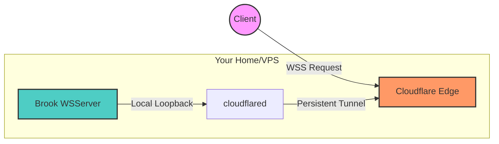

> **注：** 2026 年进行了技术审计。虽然协议在变，但 Cloudflare 边缘加速的底层逻辑依然稳健。

#### 原理
利用 `Cloudflare Tunnel` (原 Argo Tunnels) 将本地服务映射到 Cloudflare 的边缘网络。线路质量欠佳的 VPS（如 Oracle Free Tier 等）能通过 CDN 实现起死回生的加速。



#### 食用方法

1.  **准备工作**：
    *   [Cloudflare Zero Trust 控制台](https://one.dash.cloudflare.com/)：直接在 Dashboard 里创建 Tunnel，比命令行折腾证书方便。
    *   [Brook wsserver](https://txthinking.github.io/brook/#/brook-wsserver)：极其简单的逻辑。

2.  **服务端启动**：
    `brook wsserver --listen 127.0.0.1:8888 --password your_pass`

3.  **配置 Tunnel**：
    在 Cloudflare 后台将你的域名指向 `http://localhost:8888`。

4.  **关键设置 (必做)**：
    **务必在 Cloudflare 的 Network 设置中开启 WebSocket 支持**，否则 wss 连接会直接断掉。

5.  **客户端连接**：
    协议模式选 **wss**，流量走加密隧道。

#### 优缺点

**优点：**
*   **隐身**：不直接暴露 VPS IP，由 Cloudflare 抗压，基本不会被封。
*   **穿透**：支持 IPv6-only 或纯内网环境。
*   **免费**：Cloudflare 个人用户额度基本够用。

**缺点：**
*   **延时**：中转路径多了一层，延时在几百毫秒级别，不适合打游戏。
*   **UDP**：对非 HTTP 流量的 UDP 支持一般，推荐 TCP/WSS 场景。

#### 进阶参考
*   [Hysteria 2](https://github.com/HyNetwork/hysteria)：非 CF 中转场景下的性能怪兽。
*   [Cloudflare WARP](https://1.1.1.1/)：辅助优化。

---

```js
# NOTE: I am not responsible for any expired content.
create@2022-03-16T23:10:03+08:00
update@2026-01-04T05:40:00+08:00
comment@https://github.com/ferstar/blog/issues/56
```
