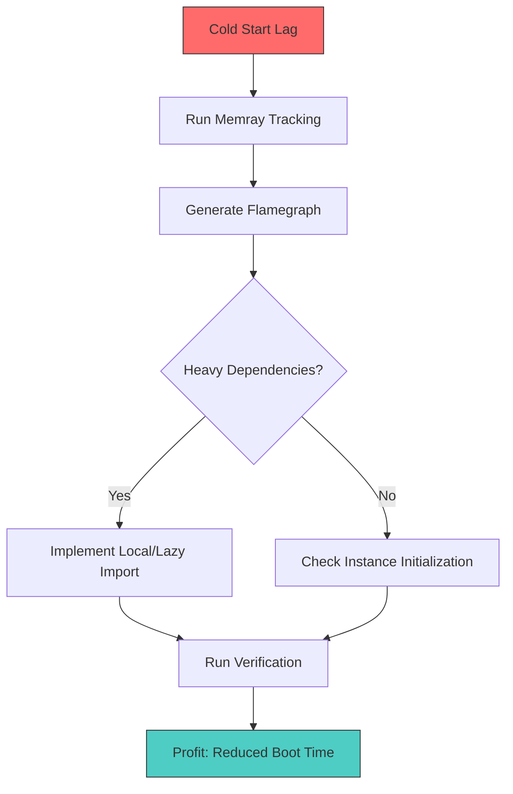

> 人生苦短，快用`memray`

> 不知不觉距离上次大的重构 #43 已经过去一年多，不曾想冷启动时间又肉眼可见的慢了起来，坚决不能忍，搞起

因为是某个炼丹项目的配套，代码有好几个人的参与。工程这边还好，组内有明确的 lint 规则以及一直坚持的 codereview，代码质量基本可控；但炼丹组的代码就显得很飘逸了，一些暗坑往往出现在这部分。炼丹我是不懂的，咋搞？上工具呗。

### 调优思路
借助 `memray` 可以清晰直观地展现出项目所有调用的内存使用情况，我们可以按照以下流程进行精准打击：



### 实战操作
这次使用的是：[memray](https://github.com/bloomberg/memray)，官网介绍很全面了，工具使用起来也是非常简单，我就用了两句：

```shell
memray run hello.py
memray flamegraph memray-hello.py.xxx.bin
```

几行用来测试的代码：

```python
import torch  # 实际项目的引用关系要复杂得多


def do_ai_pipe():
    print(torch.__version__)


if __name__ == '__main__':
    print('hello world!')

```

跑出来的火焰图是这样的：


好家伙，我跑个 hello world 就干掉三十来兆内存，明显是`import torch`搞的鬼，果断改一下`import`位置：

```python
def do_ai_pipe():
    # 可能有人会有疑问：改成 local import 的话，岂不每次调用方法都要重复 import 一次，这多浪费
    # 先说答案：不会，因为 import 是有全局缓存的，第二次 import 直接从缓存里取了
    import torch  # 实际项目的引用关系要复杂得多

    print(torch.__version__)


if __name__ == '__main__':
    print('hello world!')
```

再跑个图：


可以看到内存骤降至 KB 级别，代码几乎是不需要做什么改动的。

当然这只是一个简单的例子：某些情况下一些方法引用了一个比较重的依赖，那么就可以考虑把这个重依赖从`global import`改为`local import`，可以极大降低项目整体启动的时间和内存占用。

### 收益结算
支出：2.5 小时，基本就是 按照`memray`的指示，把该延迟引用的延迟引用，能惰性求值的换成惰性求值，不必要的初始化状态丢到对应实例化方法中，等等。

收益：未优化前启动需要 `3.5~5`s 左右按 4s 算，优化后仅 `0.8~1.2`s按 1s 算，按开发一天调试启停项目 500 次计算，每天节省 500 * 3s / 60 = 25min 相当于一个番茄钟的时间。

算起来 6 个工作日即可回本，这买卖很划算。

### 最终战果
项目冷启动内存占用减半，速度提升了2~3倍。

```shell
yyyy-mm-dd HH:18:28,729 - [INFO] [MainThread] (server:27) starting remarkable
yyyy-mm-dd HH:18:28,729 - [INFO] [MainThread] (base_handler:54) loading web handlers
yyyy-mm-dd HH:18:29,661 - [INFO] [MainThread] (file_utils:41) PyTorch version 1.4.0 available.
yyyy-mm-dd HH:18:31,789 - [INFO] [MainThread] (base_handler:79) /
yyyy-mm-dd HH:18:31,806 - [INFO] [MainThread] (server:89) Server started...
yyyy-mm-dd HH:18:31,806 - [INFO] [MainThread] (server:90) the web server is listening on http://0.0.0.0:8000


yyyy-mm-dd HH:20:06,448 - [INFO] [MainThread] (server:27) starting remarkable
yyyy-mm-dd HH:20:06,448 - [INFO] [MainThread] (base_handler:54) loading web handlers
yyyy-mm-dd HH:20:06,495 - [INFO] [MainThread] (base_handler:64) loading plugins
yyyy-mm-dd HH:20:07,615 - [INFO] [MainThread] (base_handler:79) /
yyyy-mm-dd HH:20:07,631 - [INFO] [MainThread] (server:89) Server started...
yyyy-mm-dd HH:20:07,631 - [INFO] [MainThread] (server:90) the web server is listening on http://0.0.0.0:8000
```

---

```js
# NOTE: I am not responsible for any expired content.
create@2022-05-25T08:13:58+08:00
update@2026-01-04T05:55:00+08:00
comment@https://github.com/ferstar/blog/issues/63
```
