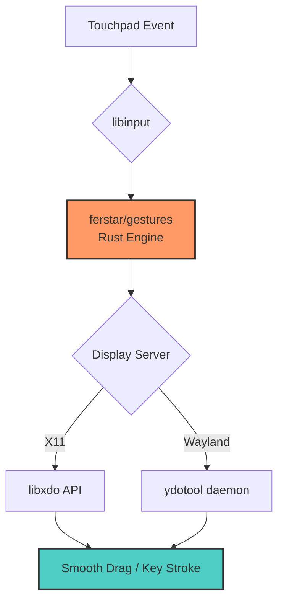

转用 Linux 后一直都比较怀念 macOS 上丝滑的**三指拖拽**效果，鉴于近几年出的 Windows 本子触控板面积以及跟手性肉眼可见的改善了很多，我觉得是时候在 Linux 上折腾下**触控板手势**了。

After switching to Linux, I've been missing the smooth **three-finger drag** experience from macOS. Given that recent Windows laptops have significantly improved touchpad size and responsiveness, I decided it was time to tackle **touchpad gestures** on Linux.

---

## 调研与选型 / Research and Selection

基本上就是两种实现思路：

1. 解析 `libinput debug-events` 输出，判断手势进而借用类似 `xdotool` 之类的工具发送具体的键盘组合或者鼠标点击或位移指令。
2. 直接调用 `libinput` API，明显此方法性能最优。

---

## 实现方案 / Implementation Approach

我选择了一个 Rust [实现](https://github.com/riley-martin/gestures)开抄，负责实现 API 级别的触控手势识别，然后缝合了另一个 Rust [实现](https://github.com/marsqing/libinput-three-finger-drag)，负责实现 API 级别的**拖拽**效果。

### 架构逻辑 / Architectural Logic



目前项目已发展到 **v0.8.1** 版本，主要改进包括：

- **双平台支持**：同时支持 X11 和 Wayland（自动检测）
- **性能优化**：
  - X11 直接使用 libxdo API，延迟最小
  - Wayland 优化 ydotool 集成，60 FPS 节流
  - 4 线程池防止 PID 耗尽
  - 正则缓存（once_cell::Lazy）
  - 事件缓存（1秒）减少配置查找

---

## 性能表现 / Performance Metrics

1. **CPU 占用极低**
   - 极限情况：疯狂三指拖拽某窗口，本 fork 实现 CPU 占用不到 1%
   - 原实现 5~10%
   - Python、Ruby 等实现 20%+

2. **资源占用**
   - 内存占用不到 5MB
   - 程序体积不到 2MB
   - 无多余依赖

---

## 安装使用 / Installation & Usage

### 依赖安装 / Install Dependencies

**Ubuntu/Debian:**
```bash
sudo apt install libudev-dev libinput-dev libxdo-dev xdotool
# Wayland 需要额外安装
sudo apt install ydotool
```

**Arch Linux:**
```bash
sudo pacman -S libinput xdotool
# Wayland
yay -S ydotool
```

### 安装程序 / Install Binary

**方法 1：直接下载预编译二进制**
```bash
# 从 Releases 下载最新版本
wget https://github.com/ferstar/gestures/releases/latest/download/gestures
chmod +x gestures
sudo mv gestures /usr/local/bin/
```

**方法 2：Cargo 安装**
```bash
cargo install --git https://github.com/ferstar/gestures.git
```

---

## 配置说明 / Configuration

配置文件使用 KDL 格式，示例：

```kdl
// 三指拖拽（X11 & Wayland 通用）
gesture "drag" swipe any {
    fingers 3
    acceleration 1.0      // 拖拽速度
    mouse_up_delay 500    // 抬手后延迟（ms）
}

// 四指上滑切换工作区
gesture "switch-workspace-up" swipe up {
    fingers 4
    exec "xdotool" "key" "super+Page_Up"
}
```

---

## 运行程序 / Running the Program

### Systemd 服务（推荐）/ Systemd Service (Recommended)

```bash
# 安装服务文件
gestures install-service

# 启动并设为开机自启
systemctl --user enable --now gestures
```

---

## 常见问题 / Common Issues

### 权限问题 / Permission Issues
需要将用户加入 `input` 组：
```bash
sudo usermod -aG input $USER
```

---

## 项目链接 / Project Links

- **GitHub**: https://github.com/ferstar/gestures
- **最新发布**: https://github.com/ferstar/gestures/releases
- **问题反馈**: https://github.com/ferstar/gestures/issues

---

**Enjoy!**

```js
NOTE: I am not responsible for any expired content.
Created at: 2023-01-29T02:08:34+08:00
Updated at: 2026-01-04T06:00:00+08:00
comment@https://github.com/ferstar/blog/issues/73
```
