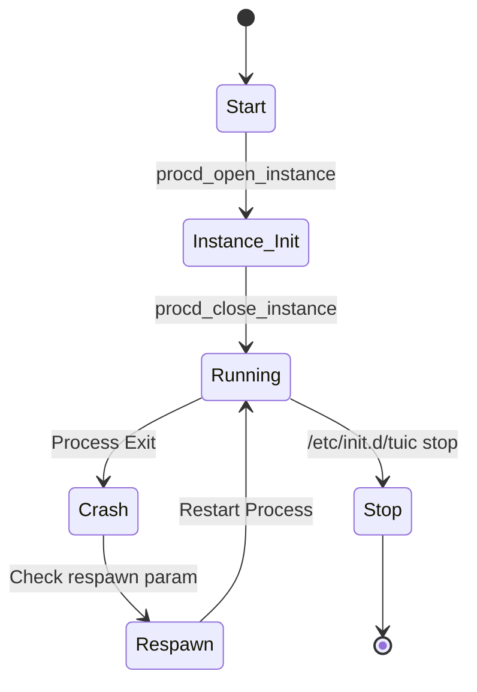

回老家把家里的红米 AX5固件升级了一下，因为之前用 ShellCrash 固定过 ssh，所以升完以后 ssh 包括 ShellCrash 依然存在，但是之前随手写的 tuic init 脚本因为在`/etc/init.d`目录，被覆盖掉，需要重写，在这里备忘一下。

### procd 守护逻辑
OpenWrt 的 `procd` 系统通过以下逻辑管理服务生命周期，重点在于 `respawn` 机制：



### 脚本示例
将以下内容保存为 `/etc/init.d/tuic`：

```shell
#!/bin/sh /etc/rc.common

START=99

SERVICE_DAEMONIZE=1
SERVICE_WRITE_PID=1
USE_PROCD=1
COMMAND="/etc/clash/tools/tuic -c /etc/clash/config.json"

start_service() {
        procd_open_instance
        procd_set_param user root
        procd_set_param respawn
        procd_set_param command $COMMAND
        procd_set_param stderr 0
        procd_set_param stdout 0
        procd_close_instance
        
}
stop_service(){
        procd_close_instance
}
```

### 使用方法
1.  **赋权**：`chmod +x /etc/init.d/tuic`
2.  **常用命令**：
    *   `start` / `stop` / `restart`: 管理服务当前运行状态。
    *   `enable` / `disable`: 开启/关闭开机自启（符号链接管理）。
    *   `reload`: 重新加载配置。

```shell
root@XiaoQiang:~# /etc/init.d/tuic
Syntax: /etc/init.d/tuic [command]

Available commands:
        start   Start the service
        stop    Stop the service
        restart Restart the service
        reload  Reload configuration files (or restart if service does not implement reload)
        enable  Enable service autostart
        disable Disable service autostart
```

---

```js
NOTE: I am not responsible for any expired content.
Created at: 2025-05-05T06:38:18+08:00
Updated at: 2026-01-04T06:10:00+08:00
comment@https://github.com/ferstar/blog/issues/89
```