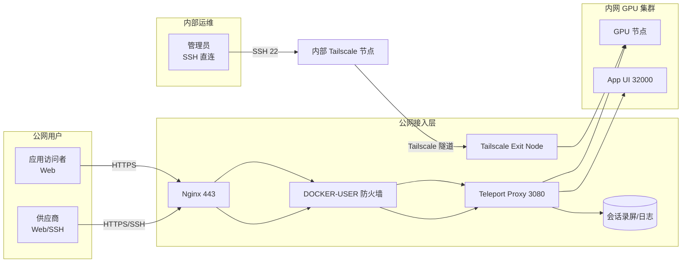

有几台 DGX H800 在内网，偶尔需要供应商远程调试。目标很明确：

1. 供应商能连上机器干活
2. 全程录屏审计，但别让他知道在录（"静默"）
3. 我们自己人要有特权通道，绕过堡垒机直连

最终方案：**Teleport** 做堡垒机与审计，**Tailscale** 负责内网互通与运维绕行通道。下面是踩坑记录和关键配置。

---

### 架构速览



---

### 踩坑 1：端口太多

Teleport 默认要开 3022-3080 多个端口，防火墙规则配置很麻烦。启用 **Multiplexing** 后可单端口搞定：

```yaml
# teleport.yaml
auth_service:
  proxy_listener_mode: multiplex
```

原理是 ALPN 自动识别流量类型，HTTPS/SSH/Tunnel 都走 3080。防火墙只管一个口就够了。

---

### 踩坑 2：内网节点装 Agent 装不上

GPU 节点在隔离内网，装 Teleport Agent 需要走代理。yum/dnf 报证书错误，最后发现要在 repo 里显式配代理：

```ini
# /etc/yum.repos.d/teleport.repo
[teleport]
proxy=http://[堡垒机VIP]:8888
```

---

### 踩坑 3：WebSocket 断连

Nginx 反代 Teleport Web Terminal，页面能打开但终端立刻断开。查了半天，三个配置缺一不可：

```nginx
proxy_pass https://127.0.0.1:3080;  # 必须 https
proxy_ssl_verify off;                # 自签名证书
proxy_http_version 1.1;
proxy_set_header Upgrade $http_upgrade;
proxy_set_header Connection "upgrade";
```

---

### 踩坑 4：Docker 端口绕过 iptables

这个最坑。Docker 映射的端口会绕过 `INPUT` 链，直接走 `DOCKER-USER`。之前写的规则形同虚设，3080 对公网敞开着。

注意：`-F` 会清空 `DOCKER-USER` 规则，生产环境请先备份，或改用 `-I` 插入。

修复版：

```bash
iptables -F DOCKER-USER
# 只允许本地和 Tailscale 网段
iptables -A DOCKER-USER -s 127.0.0.1 -p tcp --dport 3080 -j ACCEPT
iptables -A DOCKER-USER -s 100.64.0.0/10 -p tcp --dport 3080 -j ACCEPT
iptables -A DOCKER-USER -p tcp --dport 3080 -j DROP
```

---

### 踩坑 5：Nginx 指向 VPN IP 导致循环依赖

早期 Nginx 配的是 Tailscale VPN IP，结果 VPN 一抖，管理页不可用。

改成 `127.0.0.1` 本地回环，VPN 挂了照样能从公网进管理台。

---

### 权限设计

| 角色 | 登录方式 | 审计 |
|:---|:---|:---|
| 管理员 | SSH 22 端口 + Ed25519 密钥 | 无 |
| 供应商 | Web Terminal | 全程录屏，自己看不到录像 |

RBAC 配置要点：给供应商的 `restricted-dev` 角色剥离 `audit` 权限，实现"静默审计"。
注意：剥离 `audit` 仅影响录像/日志的可见性，不一定隐藏录制提示，具体以 Teleport 版本与配置为准。

补充两条更实用的限制项：
1. 供应商仅通过 Teleport Web/SSH 访问，不需要装 Tailscale。
2. 供应商角色限制登录账号与可见节点（用标签隔离）。

```yaml
# 示例：节点打标（供应商名称已脱敏）
labels:
  vendor: vendor-x
  env: prod
```

```yaml
# 示例：角色限制（供应商账号与可见节点）
kind: role
spec:
  allow:
    logins: ["vendor-user"]
    node_labels:
      vendor: "vendor-x"
  deny:
    logins: ["root"]
```

---

### 核心配置

**docker-compose.yml**

```yaml
services:
  teleport:
    ports:
      - '3080:3080'
      - '127.0.0.1:3025:3025'  # 管理 API 只本地
```

**teleport.yaml**

```yaml
proxy_service:
  public_addr: [teleport.example.com:443, 100.64.0.x:3080]
```

---

### App Access（补充）

**应用暴露示例**

```yaml
app_service:
  enabled: "yes"
  apps:
  - name: app-ui
    uri: http://10.120.0.0:32000/
    public_addr: app-ui.example.com
```

**代理环境冲突（503）**

节点有 `HTTP_PROXY` 时，Teleport 可能错误走代理访问内网服务，导致 503。给 Systemd 加 `NO_PROXY`：

```ini
# /etc/systemd/system/teleport.service
Environment="NO_PROXY=localhost,127.0.0.1,10.0.0.0/8,100.64.0.0/10"
```

**Nginx 透传 Host 头**

多子域访问时必须透传 Host：

```nginx
proxy_set_header Host $host;
```

---

这套下来，供应商走 Web 干活，内部通过 Tailscale 直连。录像审计随时调取，公网侧不暴露集群。

挺好。

---

```js
NOTE: I am not responsible for any expired content.
Created at: 2026-01-03T03:58:20+08:00
Updated at: 2026-01-03T05:55:29+08:00
Origin issue: https://github.com/ferstar/blog/issues/95
```
