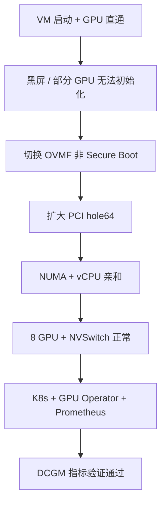

这是一篇面向实操的记录，按当时的故障路径整理关键修复点、配置片段与验证方式，避免下次重复踩坑。

## 场景与目标
- 宿主机：GPU 节点，虚拟机：`ubuntu_gpu`（KVM/libvirt, UEFI/OVMF）
- 目标：8 卡 H800 + 4 NVSwitch 直通，单节点 K8s + GPU Operator + Prometheus，可采集 DCGM 指标

## 故障现象与修复路径


### 1) 黑屏与 PCI 资源不足
- 现象：GPU 直通后 VNC 无画面，驱动报 `PCI I/O region invalid`
- 修复：切换 OVMF non-secure，扩大 PCI hole64

关键片段：
```xml
<!-- OVMF non-secure -->
<loader readonly='yes' type='pflash'>/usr/share/edk2/ovmf/OVMF_CODE.cc.fd</loader>

<!-- Q35 PCIe 64-bit hole -->
<qemu:commandline>
  <qemu:arg value='-global'/>
  <qemu:arg value='q35-pcihost.pci-hole64-size=2048G'/>
</qemu:commandline>
```

### 2) IP 不通（DHCP 绑定）
- 原因：网卡 MAC 改动导致 DHCP 租约不匹配
- 修复：恢复旧 MAC，IP 回到 `192.168.122.146`

```bash
# 旧 MAC
52:54:00:a9:a2:11
```

### 3) 资源调整（内存 + NUMA）
- 内存调整到 256GB
- vCPU 分两组 pin 到对应 NUMA node，GPU 也按 NUMA 归属放置

```xml
<memory unit='KiB'>268435456</memory>
<currentMemory unit='KiB'>268435456</currentMemory>
```

## 验证方式（GPU / K8s / 监控）
GPU：
```bash
nvidia-smi -L
nvidia-smi topo -m
nvidia-smi nvlink -s
```

K8s：
```bash
kubectl get nodes -o wide
kubectl get pods -A
```

Prometheus（DCGM 指标）：
```bash
curl http://127.0.0.1:9090/api/v1/query?query=DCGM_FI_DEV_SM_CLOCK
```

## 关键配置片段
### containerd 代理（无外网）
```ini
# /etc/systemd/system/containerd.service.d/http-proxy.conf
[Service]
Environment="HTTP_PROXY=http://100.64.0.5:8888"
Environment="HTTPS_PROXY=http://100.64.0.5:8888"
Environment="NO_PROXY=127.0.0.1,localhost,10.0.0.0/8,172.16.0.0/12,192.168.0.0/16,100.64.0.0/10"
```

### GPU Operator + Prometheus
```bash
helm upgrade --install gpu-operator nvidia/gpu-operator \
  -n gpu-operator --create-namespace \
  --set driver.enabled=false --set dcgmExporter.enabled=true

helm upgrade --install kube-prometheus-stack prometheus-community/kube-prometheus-stack \
  -n monitoring --create-namespace
```

### DCGM 指标接入 Prometheus
```bash
# ServiceMonitor 需要有与 Prometheus release 一致的标签
kubectl -n gpu-operator label servicemonitor nvidia-dcgm-exporter release=kube-prometheus-stack --overwrite
```

## 小结（可复用清单）
- PCIe 资源不足先看 `pci-hole64-size`，这步最容易被忽略
- OVMF Secure Boot 会干扰多卡启动，先用非 Secure Boot 验证
- DHCP 租约异常时，先检查 MAC 是否被改过
- 监控链路：DCGM Exporter 必须匹配 Prometheus 的 `release` 标签
