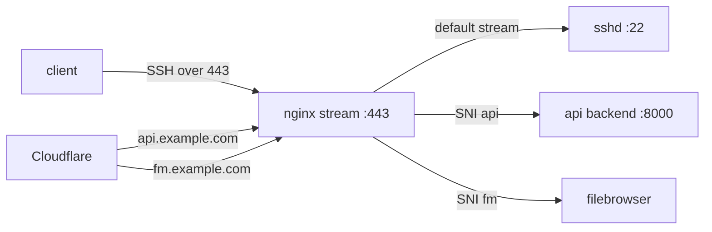

这次不是迁移，是迁移之后的小内存 VPS 被现实敲了一下。

现象很像网络问题：本机 SSH alias 直连秒断，云厂商 Web Console 卡在 connecting，Cloudflare 侧的 API 变成 521。更麻烦的是，机器上的代理服务还正常，说明不是整台机完全死掉，也不是浮动 IP、TUN 代理、SSH key 这类一眼能解释的问题。

最后重启以后 SSH 恢复，才有机会进机器复盘。结论很明确：512MB 内存太紧，系统在网络收包路径上发生了大量页分配失败，Nginx stream、SSH、API 这些入口服务被拖进了半死不活的状态。

## 故障现象

当时 SSH 失败停在密钥认证之前：

```text
kex_exchange_identification: Connection closed by remote host
```

这个错误点很关键。它说明连接已经到了远端，但还没进入正常 SSH 认证流程，所以不是 key 没换、权限不对、known_hosts 脏了这种问题。

架构上，这台机器的入口有点绕：



所以 SSH、API、文件服务都会经过 Nginx stream。只要 Nginx、内核网络栈或者本机内存状态出问题，外面看到的就会很像“SSH 挂了”和“API 挂了”同时发生。

## 真正的证据

重启后翻内核日志，关键字不是 `sshd`，而是这些：

```bash
journalctl -k --since "2026-06-13 00:00:00" | \
  egrep -i "page allocation failure|out of memory|oom|killed process"
```

重启前出现了多次 `page allocation failure`，相关进程包括：

- `containerd-shim`
- `containerd`
- `dockerd`
- `hysteria`
- `runc`
- `kswapd0`

堆栈集中在网络收包路径，能看到类似 `virtio_net`、`tcp_gro_receive`、`skb_page_frag_refill` 这些函数。也就是说，不是单个业务进程写爆了日志那么简单，而是低内存状态已经影响到了内核处理网络包。

这也解释了为什么现象会这么诡异：TCP 端口可能还能接，代理 UDP 服务也可能还活着，但 SSH 握手、Nginx stream 转发、API upstream 都可能在内存紧张时随机卡住或断开。

## 第一轮：系统和内核收拾干净

先把系统包和内核状态整理到一个可控状态。

XanMod 源之前还停留在老写法：

```bash
deb [signed-by=/etc/apt/keyrings/xanmod-archive-keyring.gpg] http://deb.xanmod.org releases main
```

这个源已经不适合当前 Debian 13，改成按 codename 的源：

```bash
deb [signed-by=/etc/apt/keyrings/xanmod-archive-keyring.gpg] http://deb.xanmod.org trixie main
```

然后安装当前 x64v3 的 XanMod 内核：

```bash
apt update
apt install linux-xanmod-x64v3
reboot
```

重启后确认：

```bash
uname -r
# 7.0.12-x64v3-xanmod1
```

旧内核也清掉，只保留当前 XanMod 相关包，避免 `/boot` 和 grub 里堆一堆过期入口：

```bash
apt autoremove --purge
apt clean
update-grub
```

顺手清理 journal 和 Docker 无用对象：

```bash
journalctl --vacuum-time=7d
docker system prune -af
```

这一步不碰 Docker volumes，避免误删业务数据。

## 第二轮：给 512MB 内存留后路

这台机器实际内存只有 454MiB 左右，不能指望“应用别吃太多”这种愿望管理。要让系统在内存紧张时有明确退路。

### 扩 swap

把 swap 扩到 2GB：

```bash
swapoff /swapfile
fallocate -l 2G /swapfile
chmod 600 /swapfile
mkswap /swapfile
swapon /swapfile
```

`/etc/fstab` 保持：

```fstab
/swapfile none swap sw 0 0
```

### zswap 改成 zstd

zswap 本来已经开了，但默认 compressor 是 `lzo`。确认内核支持 zstd：

```bash
grep -i zstd /proc/crypto
grep CONFIG_CRYPTO_ZSTD /boot/config-$(uname -r)
```

运行时切换：

```bash
echo zstd > /sys/module/zswap/parameters/compressor
cat /sys/module/zswap/parameters/compressor
# zstd
```

再持久化到 grub：

```bash
GRUB_CMDLINE_LINUX_DEFAULT="zswap.enabled=1 zswap.compressor=zstd net.ifnames=0 biosdevname=0"
update-grub
```

### sysctl 留一点网络和内存余量

新增 `/etc/sysctl.d/99-lowmem-network-tuning.conf`：

```conf
vm.min_free_kbytes = 16384
vm.swappiness = 30
vm.vfs_cache_pressure = 100
net.core.netdev_max_backlog = 2500
```

这里 `vm.min_free_kbytes` 一开始试过更高，但在 512MB 机器上太激进，反而压缩了用户态可用内存。最后回到 16MB 左右，比较像这台机器能承受的值。

## 第三轮：决定谁该先死

小内存机器最怕的是大家一起抢内存，最后内核随机挑一个关键入口杀掉。要把优先级说清楚。

### 保护入口服务

给 `ssh`、`nginx`、`supervisor` 加 systemd drop-in：

```ini
[Service]
OOMScoreAdjust=-700
```

实际检查时，`sshd` 自己已经是 `-1000`，Nginx、Supervisor 和 gunicorn 都是 `-700`：

```bash
for pid in $(pgrep -f "sshd|nginx|supervisord|gunicorn"); do
  printf "%s score=%s adj=%s cmd=%s\n" \
    "$pid" \
    "$(cat /proc/$pid/oom_score)" \
    "$(cat /proc/$pid/oom_score_adj)" \
    "$(tr '\0' ' ' </proc/$pid/cmdline)"
done
```

注意，如果 SSH 是通过 Nginx stream 进来的，重启 `nginx` 会断 SSH。改这种入口服务配置时，要么只 reload，要么准备好重连。

### 限制容器

几个代理和文件服务容器都补上资源限制：

```yaml
services:
  hysteria:
    mem_limit: 96m
    memswap_limit: 160m
    pids_limit: 128
    oom_score_adj: 500
```

不同容器按实际情况微调：

| 容器 | mem_limit | memswap_limit | pids_limit | oom_score_adj |
| --- | ---: | ---: | ---: | ---: |
| hysteria | 96m | 160m | 128 | 500 |
| hysteria2 | 96m | 160m | 128 | 500 |
| tuic-server | 64m | 128m | 128 | 500 |
| filebrowser | 96m | 160m | 128 | 500 |

这里踩了一个小坑：这台 Debian 包里的 Docker 是 `26.1.5+dfsg1`，`docker update` 不支持动态改 `--oom-score-adj`：

```bash
docker update --oom-score-adj 500 hysteria
# unknown flag: --oom-score-adj
```

所以 `oom_score_adj` 要写进 compose，然后重建容器：

```bash
docker compose up -d --force-recreate
```

验证：

```bash
docker inspect hysteria hysteria2 tuic-server filebrowser \
  --format "{{.Name}} OOM={{.HostConfig.OomScoreAdj}} Mem={{.HostConfig.Memory}} Swap={{.HostConfig.MemorySwap}} Pids={{.HostConfig.PidsLimit}}"
```

### earlyoom 提前处理

最后加 earlyoom，让它在内核真正 OOM 前先动手：

```bash
apt install earlyoom
```

`/etc/default/earlyoom`：

```bash
EARLYOOM_ARGS="-m 10,5 -s 20,10 -r 300 --prefer '(^|/)(hysteria|tuic-server|filebrowser)( |$)' --avoid '(^|/)(sshd|sshd-session|nginx|supervisord|gunicorn|systemd|dockerd|containerd)( |:|$)'"
```

这和 systemd 的 `OOMScoreAdjust` 不冲突。`OOMScoreAdjust` 会影响 `/proc/*/oom_score`，earlyoom 默认也会参考这个分数；`--avoid` 只是再加一层“别主动杀这些入口服务”的保险。

启动后日志里能看到策略：

```text
Preferring to kill process names that match regex '(^|/)(hysteria|tuic-server|filebrowser)( |$)'
Will avoid killing process names that match regex '(^|/)(sshd|sshd-session|nginx|supervisord|gunicorn|systemd|dockerd|containerd)( |:|$)'
sending SIGTERM when mem avail <= 10.00% and swap free <= 20.00%,
        SIGKILL when mem avail <=  5.00% and swap free <= 10.00%
```

## 日志别再把盘打满

这台机器根分区也不大，journal 和 Docker log 都要限一下。

`/etc/systemd/journald.conf.d/99-vps-limits.conf`：

```ini
[Journal]
SystemMaxUse=128M
SystemKeepFree=512M
RuntimeMaxUse=16M
MaxRetentionSec=7day
RateLimitIntervalSec=30s
RateLimitBurst=1000
```

Docker daemon 默认日志：

```json
{
  "log-driver": "json-file",
  "log-opts": {
    "max-size": "5m",
    "max-file": "2"
  }
}
```

另外关掉 UFW logging：

```bash
ufw logging off
```

之前有不少扫描流量触发 UFW BLOCK 日志，对小盘小内存机器都没什么好处。

## 最后验证

收尾时做了几组检查：

```bash
uname -r
# 7.0.12-x64v3-xanmod1

apt list --upgradable
# Listing...

systemctl --failed --no-pager
# 0 loaded units listed.

systemctl is-active earlyoom ssh nginx supervisor docker containerd
# active
# active
# active
# active
# active
# active
```

内存状态：

```text
Mem: 454Mi total, 235Mi available
Swap: 2.0Gi total, about 271Mi used
```

入口验证：

```bash
ssh VPS_ALIAS 'echo ok'
curl -sS -o /dev/null -w '%{http_code}\n' https://api.example.com/
curl -sS -o /dev/null -w '%{http_code}\n' https://fm.example.com/
```

结果是 SSH 正常，API 返回应用层 404，文件服务返回 200。API 的 404 是业务路由结果，不是 Cloudflare 521，也不是 upstream 挂掉。

再查优化后的内核日志：

```bash
journalctl -k --since "2026-06-13 06:28:32 UTC" --no-pager | \
  egrep -i "out of memory|oom-kill|page allocation failure|killed process"
```

没有新的 OOM 或 page allocation failure。

## 小结

这次最大的教训是：512MB VPS 可以跑，但不能靠默认配置硬扛。

尤其是 SSH 走 Nginx stream、API 也走同一个 443 入口时，入口服务必须被保护起来。真正该先让步的是代理容器、文件服务、临时任务这些低优先级进程，而不是 `sshd`、`nginx` 和 API supervisor。

当然，所有这些优化都只是把 512MB 的边界往外推一点。要从根上解决，还是升到 1GB RAM。低配能折腾，不能迷信。
