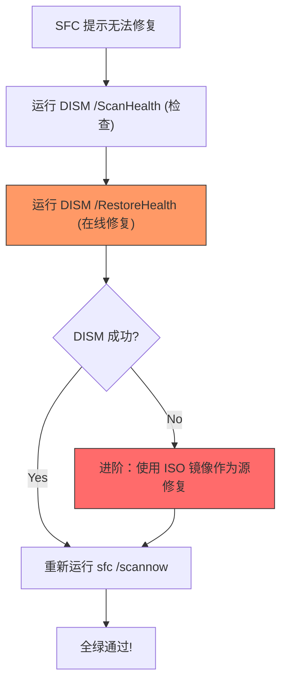

昨天更新Windows10 5月累计补丁，早上发现蓝牙耳机无法连接，折腾驱动神马的未果，怀疑是系统文件受损导致，Google一番，官方推荐`sfc /scannow`验证系统并修复受损文件，但得到的提示如下：

```powershell
开始系统扫描。此过程将需要一些时间。

开始系统扫描的验证阶段。
验证 100% 已完成。

Windows 资源保护找到了损坏文件但无法修复
其中某些文件。CBS.Log windir\Logs\CBS\CBS.log 中有详细信息。
例如 C:\Windows\Logs\CBS\CBS.log。请注意，在脱机服务方案中，
当前不支持日志记录。
```

意思是找到受损文件，但是`sfc`命令无法修复。

### 修复逻辑
为了快速解决问题，建议按照以下优先级进行：



---

### 解决过程
找到这篇文章：https://wangye.org/blog/archives/1081，照做后恢复正常。

1. **导出详细错误日志**：
```powershell
C:\WINDOWS\system32>findstr /C:"[SR] Cannot repair member file" %windir%\logs\cbs\cbs.log >"%userprofile%\Desktop\sfcdetails.txt"
```

2. **扫描组件存储健康度**：
```powershell
C:\WINDOWS\system32>DISM.exe /Online /Cleanup-image /Scanhealth

部署映像服务和管理工具
版本: 10.0.16299.15
映像版本: 10.0.16299.431

[==========================100.0%==========================] 可以修复组件存储。
操作成功完成。
```

3. **修复组件存储 (RestoreHealth)**：
```powershell
C:\WINDOWS\system32>DISM.exe /Online /Cleanup-image /Restorehealth

[==========================100.0%==========================] 还原操作已成功完成。
操作成功完成。
```

4. **最终验证 (SFC)**：
```powershell
C:\WINDOWS\system32>Sfc /scannow

验证 100% 已完成。
Windows 资源保护找到了损坏文件并成功修复了它们。
系统文件修复更改在下次重新启动之后生效。
```

---

### 如果在线修复失败
如果 `/Restorehealth` 报错找不到源（通常是由于网络或系统组件损坏太深），可以使用本地 ISO 镜像作为“血库”：

```powershell
# 挂载 ISO 后，假设盘符为 Z
DISM.exe /Online /Cleanup-Image /RestoreHealth /Source:Z:\Sources\install.wim /LimitAccess
```

```js
# NOTE: I am not responsible for any expired content.
create@2018-05-11T13:04:37+08:00
update@2026-01-04T06:30:00+08:00
```
